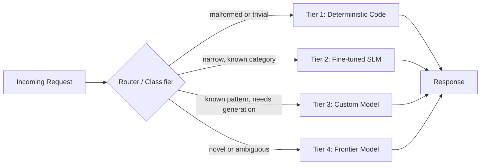
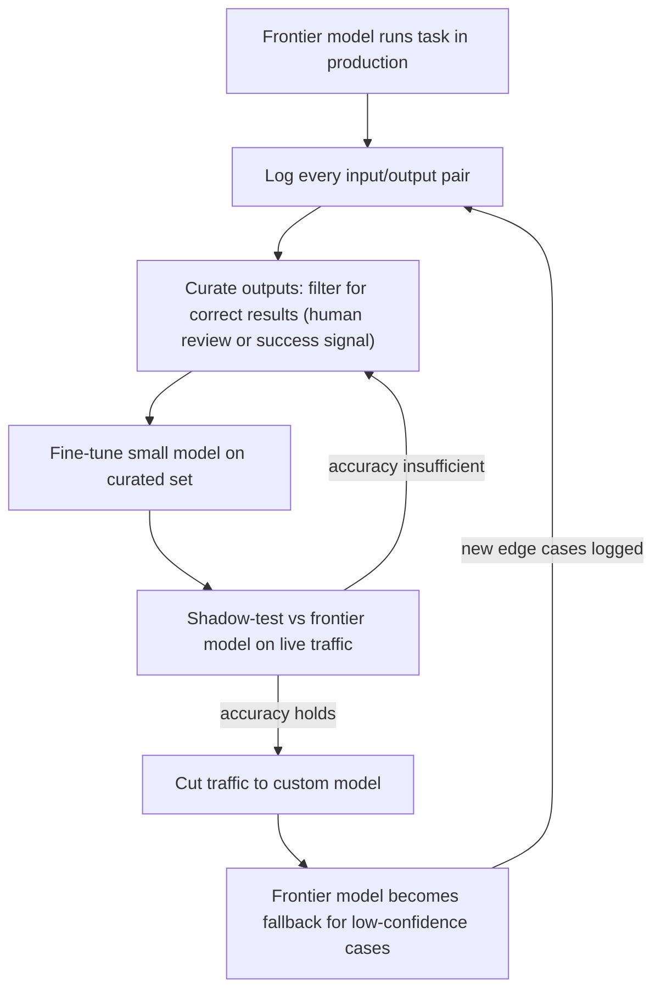
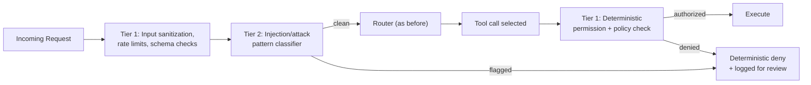
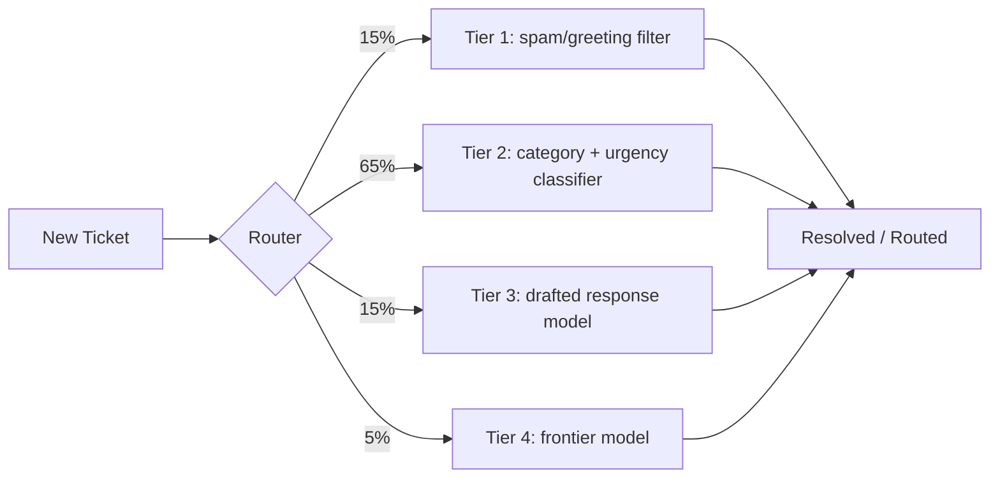

# The Most Expensive Part of Your Agent Stack Is Also the Least Predictable

ChatGPT has agents. Claude has agents. Grok has agents. Type a goal, the platform spawns an agent, picks a model, routes the task, and starts executing.

The demo looks like magic. What it hides is that most of the decisions inside that loop are not open-ended reasoning problems. They are small, bounded classification problems wearing an intelligence costume. And most builders wire a frontier model into every single one of them anyway.

This post breaks down why that's expensive, why it's unpredictable, and the architecture, security placement, cost math, and migration path teams use instead.

## What "Routing" Actually Is

When people say "the agent routes the task," they mean the system answers a handful of narrow questions: which tool does this need, which model tier can handle it, is this input safe to execute, does this task depend on another one finishing first. Each of these has a small, enumerable set of possible answers. Tool selection from a list of 12 tools is a 12-way classification problem, not an open-ended reasoning task.

That is exactly what RouteLLM and Amazon Bedrock's intelligent prompt routing do. Both are built around lightweight classifiers or learned routing policies trained on labeled examples of query difficulty and downstream task success. Neither puts a frontier model in the routing path. The frontier model is a thing the router sends traffic *to*, not a thing the router *is*.



The router itself sits outside all four tiers. It's a small classifier, not a member of the hierarchy it's assigning traffic to.

## The Cost Math Nobody Shows in the Demo

Say your agent handles routing, tool selection, and output validation with a frontier model call at each step, on top of the actual task. That's 3 extra frontier calls before any real work happens.

| Daily task volume | Extra frontier calls/day (routing only) | Cost/day @ $0.003/call | Cost/year |
|---|---|---|---|
| 50,000 | 150,000 | $450 | ~$164,000 |
| 200,000 | 600,000 | $1,800 | ~$657,000 |
| 500,000 | 1,500,000 | $4,500 | ~$1,642,000 |

That's spend on *deciding what to do*, before the agent does the thing the user actually asked for. Compare that to a Tier 2 classifier running on owned or reserved inference hardware:

| Approach | Cost per 1M routing decisions | Latency per decision | Failure consistency |
|---|---|---|---|
| Frontier model routing | $30-$60 (blended tokens) | 300-900ms | Inconsistent, drifts with sampling/prompt updates |
| Fine-tuned SLM routing (owned infra) | $1-$3 (compute amortized) | 10-40ms | Consistent, versioned, testable |
| Deterministic rules (Tier 1) | ~$0 | <1ms | Fully reproducible |

The gap isn't marginal. It's an order of magnitude on cost, another order of magnitude on latency, and a category difference on debuggability.

## Why an LLM Router Fails Differently Every Time

A rule-based router or a trained classifier fails the same way every time it fails. That's valuable: consistent failure is debuggable failure. You find the edge case, patch it, write a test, move on.

A frontier model making a routing decision is doing probabilistic next-token generation over a prompt describing the decision. Nothing forces two similar inputs to map to the same output. Temperature, an upstream prompt change on the provider's side, or plain sampling variance can send the same category of request down three different paths on three different days. When the agent fails, you now have to figure out whether the logic was wrong or whether the model just answered differently today. That ambiguity is expensive to debug and impossible to write a regression test against.

This is the real argument against "let the model figure it out" for infrastructure decisions. It's not that the model isn't smart enough. Intelligence is the wrong tool for a job that needs consistency.

## Most Agent Work Is Not Reasoning, It's Plumbing

NVIDIA's research on agent workloads found that models under 10B parameters can handle 60 to 80 percent of agentic tasks in production pipelines, at 10 to 30x lower inference cost than frontier-scale models, with comparable success rates on narrow, well-defined subtasks.

That number holds because of what agent work actually consists of once you break it down: parsing a command into structured intent, generating a JSON payload against a fixed schema, extracting a field from unstructured text, classifying a ticket or log line into one of N categories, calling a tool with arguments already determined upstream. None of this is reasoning from first principles about a novel problem. It's pattern matching against a distribution a much smaller model has already seen thousands of times.

## The Three-Tier Architecture (Four, Counting the Escalation Path)

### Tier 1: Deterministic code, the floor

If a task can be fully expressed as an if/else, a regex, a schema validator, or a state machine, it should never touch a model.

```python
# Tier 1 example: deterministic intent pre-filter
# runs before anything reaches a model
def classify_intent_fast(text: str) -> str | None:
    text = text.lower().strip()
    if text in GREETING_PATTERNS:
        return "greeting"
    if EMAIL_REGEX.search(text):
        return "contact_extraction"
    if text.startswith(("cancel", "stop", "refund")):
        return "cancellation"
    return None  # fall through to Tier 2
```

### Tier 2: Fine-tuned small models, the specialists

For classification or extraction that needs more than rules but not general reasoning, a fine-tuned 1B-8B model matches frontier accuracy on its narrow task, at a fraction of the cost, running on infrastructure you own.

### Tier 3: Custom models trained on your own traffic, the domain experts

This is the tier most teams skip because it sounds like a research project. It's a loop, not a one-time build:



The loop doesn't end after cutover. New edge cases the custom model can't handle confidently get logged and fed back in, so the model keeps improving on your actual traffic distribution instead of staying frozen at its first training snapshot. OpenAI and AWS have both productized versions of this exact workflow.

### Tier 4: The frontier model, the escalation path

This tier should get the smallest share of traffic, not the largest: genuinely ambiguous intent, multi-step reasoning across a novel tool combination, or synthesis tasks that need general intelligence rather than pattern matching.

## Where Security Actually Belongs

This is the tier most teams get backwards. The instinct is to put a frontier model in front of every request to "reason about" whether it's safe, a prompt injection, or malicious tool use. That's the same mistake as LLM routing, and it fails the same way: inconsistently, and expensively.

Security and guardrails are a cross-cutting layer, not a tier of their own, and most of the actual defense belongs at Tier 1, not Tier 4:

- **Input sanitization, schema validation, and length/rate limits** are deterministic. They run before the router sees the request at all.
- **Prompt injection detection** for known attack patterns (instruction override phrases, encoded payloads, suspicious delimiter sequences) is a classification problem, which makes it a Tier 2 job for a fine-tuned small model, not a Tier 4 job for a frontier model reasoning about it fresh each time.
- **Tool-call argument validation** (does this action touch a resource this user is authorized for, is this amount within policy) is deterministic policy enforcement. It belongs in code, with a hard deny, not in a prompt asking a model to "please check permissions first."
- **The frontier model only gets involved** for genuinely novel attack patterns that don't match any known signature, and even then its output should still pass through the same deterministic policy checks before any action executes. A frontier model is never the last line of defense on an action with real-world consequences.



The pattern is identical to the cost argument: put consistency-critical decisions in deterministic or small-model layers, and reserve the frontier model for cases that genuinely need judgment, with a deterministic check still gating anything that actually executes.

## What This Looks Like End to End

A support-ticket triage agent built this way:

| Tier | Handles | Approx. share of traffic |
|---|---|---|
| 1: Deterministic | Spam, greetings, malformed input | ~15% |
| 2: Fine-tuned SLM | Category + urgency classification | ~65% |
| 3: Custom model | Drafted responses for known patterns | ~15% |
| 4: Frontier | Novel complaints, true escalations | ~5% |



Total frontier spend on this pipeline is a fraction of the all-LLM version, and every tier below Tier 4 fails in ways you can actually inspect and fix.

## Migration Case Study: A 90-Day Retrofit

Take a composite of the pattern above, sized like a mid-market SaaS support pipeline: 300,000 tickets a month, starting from an all-frontier-model setup where every ticket hits the frontier model for classification, drafting, and routing.

**Before (all-frontier, month 0):**

| Metric | Value |
|---|---|
| Frontier calls per ticket | 3 (classify, route, draft) |
| Monthly frontier calls | 900,000 |
| Monthly model spend | ~$8,100 |
| Median latency per ticket | ~1.8s |
| Inconsistent-classification rate (same ticket type, different label on retry) | ~6% |

**Days 1-30: instrument and target.** Logging added to all three call sites. Classification picked as the first migration target since it's the highest-volume, most narrowly-scoped decision (a fixed label set, unlike free-form drafting). ~40,000 labeled examples curated from 30 days of logs, filtered down to ~18,000 after removing low-confidence or contested labels.

**Days 31-55: fine-tune and shadow-test.** A small model fine-tuned on the curated set, shadow-tested against the frontier model on live traffic without affecting production. Agreement rate with frontier-model labels: 94% after the first pass, 97% after a second round of fine-tuning on the disagreement cases.

**Days 56-60: cutover.** Classification traffic cut over to the fine-tuned model. Frontier model kept as fallback for anything under a confidence threshold.

**Days 61-90: repeat for drafting.** Same loop applied to the response-drafting call, since it's the second-highest-volume site and had accumulated three months of curated resolved-ticket examples by this point.

**After (day 90):**

| Metric | Value | Change |
|---|---|---|
| Frontier calls per ticket | 0.15 avg (classification and drafting both mostly off-frontier) | -95% |
| Monthly frontier calls | ~135,000 | -85% |
| Monthly model spend | ~$1,400 (frontier) + ~$310 (SLM compute) | -79% total |
| Median latency per ticket | ~340ms | -81% |
| Inconsistent-classification rate | ~0.4% | -93% |

Routing itself was left on a simple classifier from day one, since it was the smallest, most bounded decision and never justified frontier-model cost in the first place. The frontier model still runs, just on the ~5% of tickets that are genuinely novel, which is exactly where it should have been spending its budget all along.

## Model Selection by Tier

A concrete starting point rather than an abstract "use a small model" recommendation. Exact pick depends on your infra and latency budget, but this is roughly where teams land:

| Tier | Job | Example models / tools |
|---|---|---|
| Router | Traffic classification, tier assignment | RouteLLM, Amazon Bedrock intelligent prompt routing, a custom logistic regression or gradient-boosted classifier on embedding features |
| 1: Deterministic | Validation, parsing, guardrail rules | Plain code: regex, JSON schema validators (e.g. Pydantic, Zod), state machines, policy engines (e.g. OPA) |
| 2: Fine-tuned SLM | Classification, extraction, injection detection | Small open-weight models in the 1B-8B range, fine-tuned via LoRA/QLoRA on task-specific data, served via vLLM or a managed small-model endpoint |
| 3: Custom model | Drafting, domain-specific generation | A fine-tuned mid-size open model, or a distilled version of the frontier model's outputs on your own traffic, retrained on a rolling schedule |
| 4: Frontier | Novel reasoning, ambiguous synthesis | Claude, GPT, Gemini class models, called sparingly and only after Tiers 1-3 have ruled out a narrower fit |

The point isn't the specific model names, which will be outdated in a year. It's the shape: a named, swappable component at each tier, versioned and testable, instead of one frontier model doing every job by default.

## Your Moat Isn't the Model

Everyone building on Claude, GPT, or Grok has access to the same frontier intelligence. That was never the differentiator, it's the entry fee.

The differentiator is the layer underneath: the deterministic floor that never breaks, the fine-tuned specialists that get cheaper and more accurate as they see more of your own traffic, the guardrails that don't rely on a model's judgment for anything with real consequences, and the escalation logic that knows exactly when a task is worth the expensive call. That layer doesn't show up in a demo. It's the only part of the stack a competitor can't replicate just by signing up for the same API key you have.

If your agent architecture routes every decision through a frontier model, you don't have an agent stack. You have an expensive, unpredictable API wrapper wearing an agent costume.
