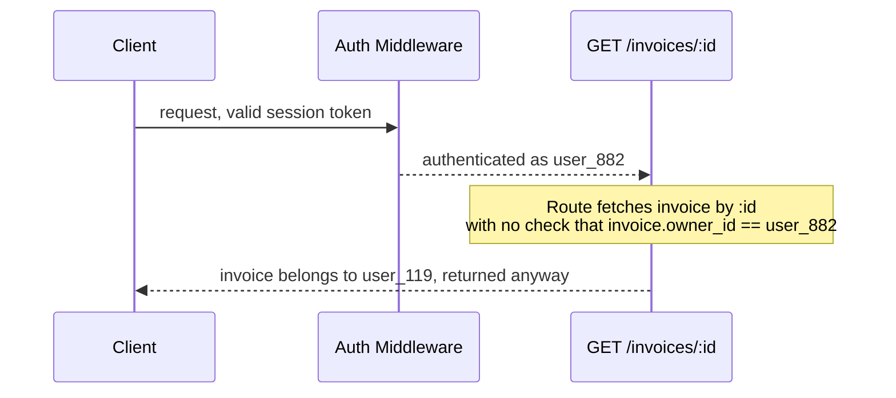

Part 1 was the security group. Part 2 went under it, into iptables, nftables, and conntrack. Part 3 went one layer further, into what a load balancer actually does to a connection. Part 4 went earlier than all three, into DNS and the CDN edge, the system that decides whether your load balancer ever sees the request at all.

This part doesn't go earlier. It goes to the end of the line, because there isn't a layer after it. Once a request has survived the security group, the OS firewall, the load balancer, and the edge, it lands on your application, and your application has to decide, on its own, whether the thing standing in front of it is who and what it claims to be. Every layer before this one filtered traffic based on network-level facts: source IP, port, connection state, cache key, DNS record. None of those facts say anything about identity. A request that passed every network check can still be the wrong person, an expired session, or a token that was never supposed to reach this far. The application is the last place any of that gets caught, and the first four posts in this series all quietly assumed it would be.

## The Request That Arrives Is Not the Client

By the time a request reaches application code, it has been touched by every layer this series has already covered, and each one of them can rewrite the parts of the request your code is about to trust.

`X-Forwarded-For` is the clearest example. It exists so an application behind a load balancer or proxy can recover the client's original IP, since the load balancer terminates the real connection and opens its own, the exact behavior Part 3 covered. But `X-Forwarded-For` is just a header. If your load balancer is configured to append the client IP to whatever value already arrived, and your application trusts the first value in that list without checking how many hops actually touched the request, a client can set their own `X-Forwarded-For` header and appear to originate from any IP they want.

```
# What a client can send directly, with no load balancer involved
X-Forwarded-For: 10.0.0.1, 127.0.0.1

# What your application sees if it reads index 0 without validating
# how many proxies are actually in front of it
client_ip = request.headers["X-Forwarded-For"].split(",")[0]
# -> "10.0.0.1", fully attacker-controlled
```

The fix is knowing exactly how many trusted proxies sit in front of your application and reading the IP that many hops from the *right* end of the list, or better, having the outermost trusted proxy (your load balancer or CDN) strip any client-supplied `X-Forwarded-For` and set its own. Most frameworks have a `trust proxy` style setting for exactly this reason. Left at its default, an application either trusts nothing, which breaks rate limiting and geo logic that depend on the real client IP, or trusts everything, which means IP-based access control is decorative.

The pattern underneath this is the same one every layer in this series has demonstrated: the thing arriving at your code is not a fact about the world, it's a claim, shaped by every system between the client and you, and the application is the first place anyone checks whether the claim is true.

## Authentication Proves Identity, Authorization Proves Permission

These get treated as one problem, solved by one middleware, and that's where the actual bug lives.

Authentication answers "who is this." Authorization answers "is this person allowed to do the specific thing they're asking to do, to the specific resource they're asking to do it to." A request can pass authentication cleanly, a valid session, a valid token, a real logged-in user, and still be an attack, because the thing being checked is only ever "are you someone," never "are you allowed to touch this."



This is broken object-level authorization, and it's consistently one of the most common real-world API vulnerabilities, precisely because it survives every test that only checks "does the endpoint require login." It does require login. Logging in as anyone at all is enough to walk the same route with a different `:id` and read, or write, another user's data. A security group audit doesn't catch this. A load balancer health check doesn't catch this. It's invisible at every layer this series has covered so far, because the request is legitimate right up until the moment it asks for something it shouldn't be allowed to have, and that check only exists if someone deliberately wrote it, on every route that touches user-scoped data, not just the ones that felt sensitive at the time.

```bash
# The audit that actually finds this: not "which routes require auth,"
# but "which routes take an ID from the request and never check
# that the authenticated user actually owns or can access that ID"
grep -rn "req.params.id" src/routes | while read -r line; do
  file=$(echo "$line" | cut -d: -f1)
  echo "check $file for an ownership check after the lookup"
done
```

No grep pattern fully finds this. It's a judgment call made route by route, which is exactly why it survives code review: the route works, the tests pass with the test user's own data, and nobody wrote the test that logs in as user A and requests user B's resource.

## A Valid Token Is Not the Same as a Token That Should Still Work

JWTs get treated as self-verifying, and structurally they are, the signature proves the payload wasn't tampered with. What they don't prove is that the token should still be trusted right now.

```
header.payload.signature
       ^
       exp: 1785600000   <- this only matters if something checks it
       iat: 1785513600
       sub: "user_882"
```

Signature verification and expiry checking are two separate steps, and skipping either one is a real, recurring category of bug, not a hypothetical. The algorithm confusion attack is the sharpest version: some JWT libraries, if not explicitly restricted, will accept a token whose header declares `alg: none`, or will verify an RS256-signed token using its own public key as if it were an HMAC secret, because the public key is, well, public, and an attacker can forge a valid-looking HMAC signature with it if the server doesn't pin which algorithm it expects. The fix is boring and non-negotiable: explicitly whitelist the accepted algorithm on verification, never read it from the token itself.

```
// Wrong: trusts whatever algorithm the token claims to use
jwt.verify(token, secretOrPublicKey)

// Right: the server decides the algorithm, the token doesn't get a vote
jwt.verify(token, secretOrPublicKey, { algorithms: ["RS256"] })
```

The second, quieter gap is revocation. A JWT is valid until it expires, full stop, unless the application maintains something outside the token itself to check against, a denylist, a token version on the user record, a short-lived access token paired with a revocable refresh token. Log a user out, force a password reset, or ban an account, and every unexpired JWT that user already holds keeps working exactly as before, because the token doesn't know any of that happened. It's still correctly signed. It's still unexpired. Nothing about the token is wrong. The gap is that "logged out" is an application-level fact the token was never designed to carry, and if nothing enforces it separately, the account is never actually logged out from the token's perspective, no matter what the login page shows.

## The Endpoint Nobody Gated

The most common version of this gap in practice isn't cryptographic. It's an endpoint that exists, works correctly, and was never put behind the same authorization check as everything around it, because it wasn't built as a user-facing feature. Internal tooling routes, simulation or test endpoints, admin actions exposed as a plain REST route "just for now," debug flags left reachable in production. Each one was reasonable in isolation, usually written under deadline, meant to be temporary or internal, and never revisited once the feature it supported shipped.

None of the first four layers in this series catch this. The security group correctly allows traffic on the port the whole API runs on, because the endpoint isn't a separate service. The load balancer correctly routes it, because routing doesn't know or care what a path does. DNS resolved correctly. The only place this can be caught is the application itself, deciding, per route, who is allowed to call it, and that decision has to be made explicitly, because the default behavior of an unguarded route is that anyone who knows or guesses the path can call it.

```bash
# The actual audit: enumerate every route, then check which ones
# have no auth middleware attached, not which ones you remember writing
grep -rn "router\.\(get\|post\|put\|delete\)" src/routes \
  | grep -v "authGuard\|requireAuth\|isAuthenticated"
```

This is a checklist item, not a one-time fix. Every new route is a new instance of the same question, and the failure mode is always the same shape: the endpoint worked, was tested by the person who built it while logged in as themselves with full access, shipped, and stayed reachable by anyone for however long it takes someone to notice it was never gated in the first place.

## Auditing This Layer

```bash
# Every route in the app, cross-referenced against which ones
# actually run an auth check before touching data
grep -rn "router\." src/routes --include="*.ts" -A1 | grep -B1 -v "Guard\|Auth"

# Decode a JWT without verifying it, to see what it actually claims,
# then separately confirm your server enforces alg + exp on verification
echo "<token>" | cut -d. -f2 | base64 -d 2>/dev/null | jq .

# Log in as user A, request a resource that belongs to user B by ID,
# and check whether the response is a 403 or the actual data
curl -H "Authorization: Bearer <user_A_token>" \
  https://api.example.com/invoices/<user_B_invoice_id>

# Confirm a token issued before a logout or password reset is actually
# rejected afterward, not just expired on its own schedule
curl -H "Authorization: Bearer <token_issued_before_logout>" \
  https://api.example.com/me
```

The `curl` as user A against user B's resource is the single most useful five minutes in this entire audit. It requires no tooling, no static analysis, just two accounts and the willingness to ask the API for something that isn't yours.

## The Case That Keeps Repeating

An internal simulation endpoint gets built to let the team test a flow without going through the full production path. It's fast to write, it's only ever called from an internal tool, and gating it behind the same authorization layer as the public API feels like unnecessary work for something "only the team uses." It ships. Months later, someone finds the path, either by guessing, by reading a bundled frontend's network calls, or by scanning for common internal-sounding route names, and calls it directly, with no session, no role check, nothing standing between the request and whatever the simulate endpoint is capable of doing.

Every layer before the application did its job correctly. The security group allowed the traffic, because it's the same API surface as everything else. The load balancer routed it, because routing has no concept of "internal" versus "public" paths. DNS resolved the domain like it resolves every domain. The gap was never in the network. It was in an assumption, made once, under time pressure, that obscurity was a substitute for a check, and never revisited once the endpoint stopped feeling temporary.

## Where the Ownership Gap Actually Sits

Five layers into this series, the shape hasn't changed once. Security group to OS firewall. OS firewall to load balancer. Load balancer to the instance behind it. DNS and the CDN edge to the load balancer that never sees the request if the edge answers it first. And now, at the very end of the path, the application itself, deciding whether the thing that survived every layer before it is actually who it claims to be, and actually allowed to do what it's asking to do.

This is the layer where the assumption running underneath the entire series finally surfaces: every prior post proved that the network can't be trusted to guarantee the request in front of your code is legitimate. Correct security groups don't authenticate anyone. A correctly terminated connection at the load balancer doesn't prove authorization. A cache-hit response from the edge doesn't know who's asking. None of the first four layers were ever going to catch a valid session requesting someone else's data, or a token that's technically unexpired but should have died the moment its owner logged out, or a route that works exactly as written and was simply never told it needed to check.

Four layers of network configuration, each independently correct, each reviewed by whoever owns that boundary, and the actual decision that matters, whether this specific request should be allowed to do this specific thing, was always going to be made here, by code that has to assume nothing upstream already handled it. That's not a flaw in the first four parts of this series. It's the reason they exist: to prove, layer by layer, that the network will never do the application's job for it, no matter how correctly every boundary in front of it is configured.
