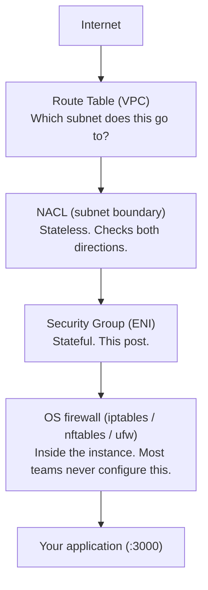
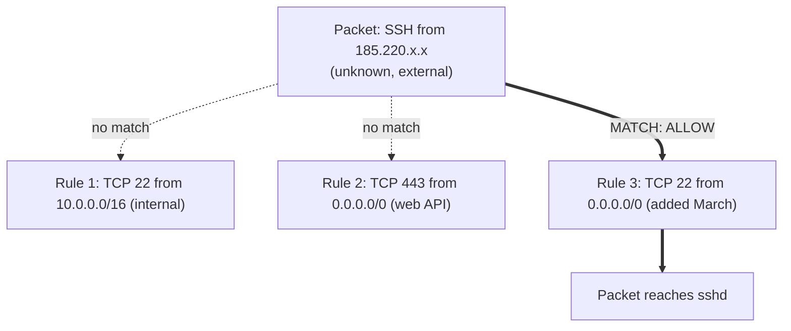
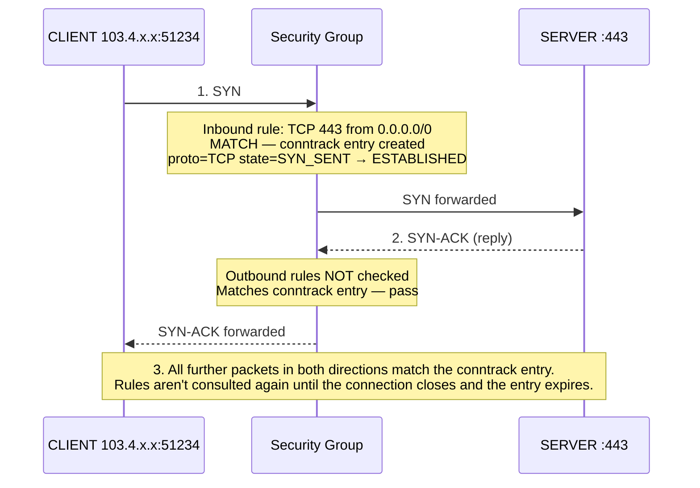
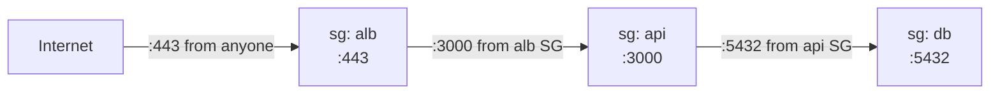
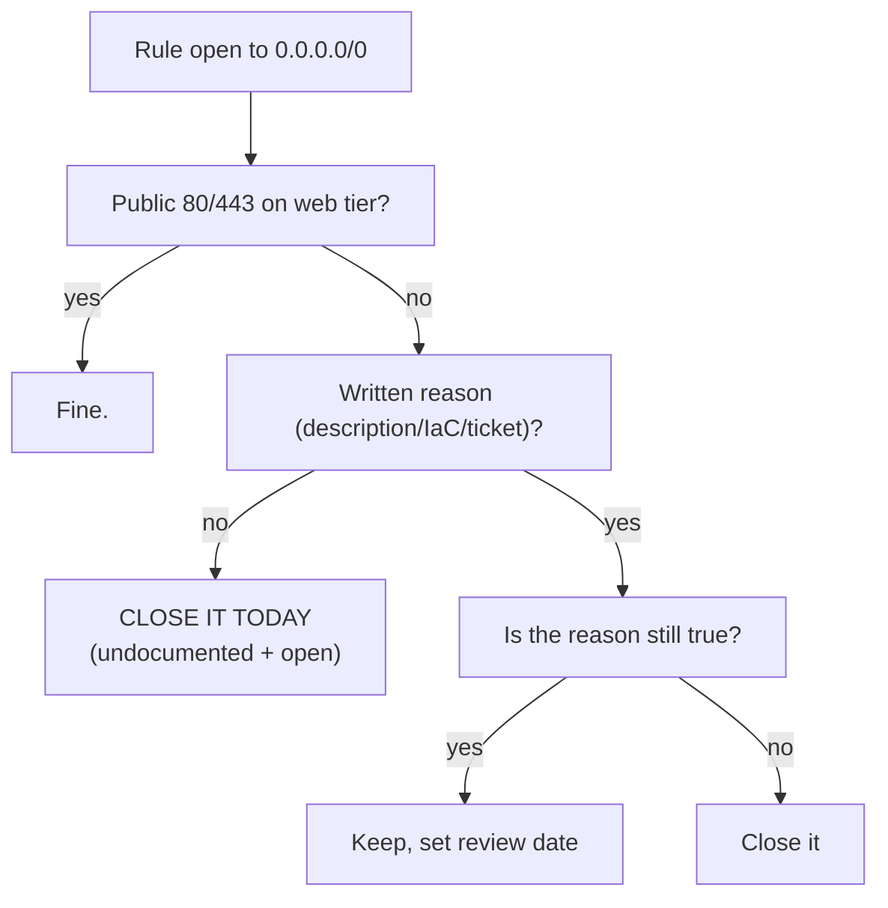

> **TL;DR**: A security group is a stateful, allow-only virtual firewall attached to a network interface, not an instance or subnet. It tracks connections, so allowing inbound traffic automatically allows the matching reply, and all rules are evaluated together with no ordering, so one permissive rule anywhere silently overrides every careful rule beside it. The mechanism is simple. The risk comes from the lifecycle: rules opened under deadline pressure in the console, with no description and no owner, that outlive the project they were opened for.

---

## What Is a Security Group, Actually?

The one-line answer: a security group is a virtual, stateful firewall that controls inbound and outbound traffic at the network interface level of your cloud resources.

Every word in that sentence carries weight, so let's break it down.

**Virtual** means there is no firewall appliance. No box, no dedicated software running inside your instance. The filtering happens in the hypervisor layer, outside your operating system. Your Ubuntu server never sees the packets that a security group drops. They're gone before they reach the kernel's network stack. This is why `iptables -L` on your EC2 instance shows you nothing about security group rules. They live in a different layer entirely.



**Stateful** is the most important word and the most misunderstood. It means the security group tracks connections, not just packets. If an inbound rule allows traffic in, the response traffic is automatically allowed out, regardless of what your outbound rules say. We'll go deep on this in the How section, because connection tracking is the mechanism that makes security groups feel "magic" until the day it surprises you.

**Network interface level** means the rules attach to the ENI (Elastic Network Interface), not to the instance, not to the subnet. One instance can have multiple ENIs with different security groups. One security group can be attached to hundreds of ENIs. This attachment model is why a single sloppy rule can expose an entire fleet.

### Anatomy of a Rule

A security group rule has exactly four meaningful parts:

| Type | Protocol | Port Range | Source |
|---|---|---|---|
| SSH | TCP | 22 | `203.0.113.42/32` — one IP |
| HTTPS | TCP | 443 | `0.0.0.0/0` — the internet |
| Custom | TCP | 5432 | `sg-0abc123def` — another security group |

That third row is the feature most people underuse: **the source can be another security group.** Instead of saying "allow Postgres from IP 10.0.1.5," you say "allow Postgres from anything wearing the `api-server` security group." Instances come and go, IPs change, autoscaling spins up new machines, and the rule keeps working because it references identity, not address. This one feature is the difference between security groups that rot and security groups that scale.

Two structural facts complete the picture:

1. **Security groups are allow-only.** There are no deny rules. Everything is denied by default, and rules only ever punch holes. This means the risk surface is exactly the sum of your rules. You cannot accidentally deny legitimate traffic with a bad rule, but every rule you add is a door.
2. **All rules are evaluated together.** There's no ordering, no priority, no "first match wins." If any rule allows the packet, the packet passes. This is radically different from iptables or NACLs, and it means a permissive rule anywhere in the group silently overrides every careful narrow rule beside it.

That second point is where audits go wrong:



Rule 1 looks responsible. Rule 3 makes Rule 1 decorative. This is why "we have a restricted SSH rule" means nothing until you've read every rule in the group.

---

## Why Do Security Groups Work This Way?

Three design decisions define security groups, and each one exists for a reason worth understanding.

### Why stateful?

Before stateful firewalls, admins had to write rules for both directions of every conversation. Allow inbound TCP 443, and also allow outbound TCP from port 443 to ephemeral ports 1024-65535, because that's where the client's response goes. Get the ephemeral range wrong and connections mysteriously hang. Multiply that by every service and the ruleset becomes unmaintainable, which in practice means people open everything.

Stateful filtering solves this with connection tracking: the firewall remembers "instance X accepted a connection from client Y on port 443" and automatically permits the reply traffic for that specific connection. Your ruleset describes intent ("this server serves HTTPS") instead of packet mechanics.

### Why default-deny, allow-only?

Because the alternative fails badly at scale. In a deny-rule system, security depends on rule ordering, and a misordered rule fails open. In an allow-only system, forgetting a rule fails closed: something legitimate breaks, someone notices, someone adds the rule. Annoying, but visible. The failure mode of allow-only is a support ticket. The failure mode of misordered deny rules is a breach nobody sees.

### Why attach to the interface instead of the subnet?

Because workloads move and subnets are geography, not identity. Attaching security to the ENI means the policy travels with the workload. Your database's rules are the database's rules whether it lives in subnet A or gets migrated to subnet B during a re-architecture. It also enables the SG-references-SG pattern from earlier, which is fundamentally an identity-based security model wearing a firewall costume.

### Security Groups vs NACLs

They look similar in the console. They are not similar.

| | Security Group | NACL |
|---|---|---|
| Attaches to | ENI (instance-level) | Subnet boundary |
| State | Stateful | Stateless |
| Rule types | Allow only | Allow and deny |
| Evaluation | All rules together | Numbered order, first match wins |
| Return traffic | Automatic | Needs explicit rule |
| Typical use | Primary control for every workload | Coarse blast-radius limits, IP blocking |

The practical guidance: security groups are your primary tool for everything. NACLs earn their keep in two cases: blocking a known-hostile IP range (security groups can't deny), and enforcing subnet-level guarantees like "nothing in the data subnet talks to the internet, period," as a backstop against a fat-fingered security group. If you're writing per-application NACL rules, you're using the wrong tool.

---

## When Do Security Group Rules Get Created? The Lifecycle Nobody Manages

Here's where this stops being an AWS documentation summary and becomes the actual point of this post.

Every security group rule is born in one of a few moments, and each birth context predicts whether the rule will ever die:

| Born during | Documented? | Ever removed? |
|---|---|---|
| Initial architecture | Usually | N/A (kept) |
| Infrastructure-as-code change | Yes, in the PR | Yes, in the next PR |
| Debugging session | Never | Rarely |
| Deadline crunch | Never | Almost never |
| "Just for the demo" | Never | Never |

The rules created in the top two rows are fine. They live in Terraform or CloudFormation, they have a commit message, they get reviewed, and removing them is a normal code change.

The bottom three rows are where breaches come from. These rules are created in the console, under time pressure, by someone whose actual task is something else. Opening the rule takes thirty seconds. The mental note to close it evaporates the moment the deadline passes.

Now add the delivery handoff. In freelance and agency work, a project has a hard boundary: it ships, the client is happy, the invoice is paid, the team moves on. Every console-created rule from the crunch phase is now orphaned. The people who know why port 6379 is open have moved to the next client. The client's team, if there is one, inherits a security group they didn't write and are afraid to touch, because removing a rule they don't understand might break production.

In-house teams don't avoid this because they're better engineers. They avoid it because they still own the system next quarter. Ownership after delivery is the entire difference. The rule doesn't know the project ended. It keeps doing exactly what it was told, for an audience that was supposed to be temporary, forever.

---

## How It Actually Works: Connection Tracking at the Packet Level

Let's trace real traffic. Your NestJS API runs on an EC2 instance, security group allows inbound TCP 443 from `0.0.0.0/0`. A user in Dhaka opens the app.



Three consequences of this mechanism catch people in production:

**1. Removing a rule doesn't kill live connections.** If an attacker has an established SSH session and you delete the SSH rule, tracked connections may persist until they close. Rule removal stops new connections. For an active incident, you need to kill the connection itself (or use an untracked rule pattern / NACL deny, which is stateless and applies immediately).

**2. Outbound rules matter less than people think, until they matter completely.** Most security groups ship with the default "allow all outbound." Because return traffic bypasses outbound rules anyway, tightening outbound only affects connections your instance initiates. That's exactly the traffic that matters during a compromise: malware phoning home, data exfiltration, a cryptominer pulling its payload. An instance that can only initiate outbound to your database security group and your package mirror is a dramatically worse host for an attacker than one with open egress.

**3. The security group can't save you from what runs inside.** Filtering happens at the ENI. If two processes on the same instance talk over localhost, no security group is involved. If your app is proxied through nginx on the same box, the security group sees only nginx's port.

### Implementation: what good actually looks like

Here's a realistic three-tier setup expressed as Terraform, using the SG-references-SG pattern:

```hcl
resource "aws_security_group" "alb" {
  name   = "alb-prod"
  vpc_id = var.vpc_id

  ingress {
    description = "Public HTTPS"
    from_port   = 443
    to_port     = 443
    protocol    = "tcp"
    cidr_blocks = ["0.0.0.0/0"]   # correct: it's a public load balancer
  }
}

resource "aws_security_group" "api" {
  name   = "api-prod"
  vpc_id = var.vpc_id

  ingress {
    description     = "App traffic from ALB only"
    from_port       = 3000
    to_port         = 3000
    protocol        = "tcp"
    security_groups = [aws_security_group.alb.id]   # identity, not IP
  }
}

resource "aws_security_group" "db" {
  name   = "db-prod"
  vpc_id = var.vpc_id

  ingress {
    description     = "Postgres from API tier only"
    from_port       = 5432
    to_port         = 5432
    protocol        = "tcp"
    security_groups = [aws_security_group.api.id]
  }
}
```



The database has no rule that references an IP address. It cannot be reached from the internet even if someone fat-fingers a route table. Autoscaling the API tier requires zero security group changes.

Notice what's absent: SSH. Modern setups use SSM Session Manager or EC2 Instance Connect, which need no inbound port at all. If you must have SSH, it's `/32` to a bastion or VPN CIDR, never `0.0.0.0/0`, and ideally it's a rule you add for the session and remove after.

Notice also every rule has a `description`. This sounds like bureaucracy until it's the only artifact standing between "opened for the March 3rd load test, safe to remove" and "nobody knows, nobody dares."

---

## Real-Life Examples: How This Fails in Production

**The exposed Redis instance.** A team stands up Redis for a job queue. To let a developer inspect it from their laptop during debugging, someone opens TCP 6379 to `0.0.0.0/0` "for an hour." Redis, by default and by philosophy, ships with no authentication, because it assumes it lives on a trusted network. Internet-wide scanners like Shodan and masscan sweep the entire IPv4 space continuously; an open 6379 is typically discovered within hours, not months. The standard outcome is a cryptominer installed via Redis's own `CONFIG SET` and cron-write tricks. Nothing was "hacked." Every system did exactly what its configuration said.

**The database that outlived its migration.** During a data migration, a contractor adds an inbound rule on the RDS security group: TCP 5432 from their office IP. Reasonable. The migration finishes on a Friday, the contract ends, the rule stays. Two years later the "office IP" belongs to whoever leases that address block now. The client discovers the rule during a SOC 2 audit, where `0.0.0.0/0` or unexplained CIDR rules on database ports are automatic findings, surfacing at the worst possible moment: during their own compliance push, with nobody left who remembers the rule's story.

**The staging environment that became load-bearing.** An agency spins up staging with everything open ("it's just staging") including the app's debug port. Staging quietly starts holding a copy of production data for realistic testing. The environment now has production-grade data with demo-grade perimeter, and it appears in zero security reviews because everyone's mental model still says "it's just staging."

Different projects, same shape: a rule created for a moment, in a system nobody owned after the moment passed.

---

## Auditing: The Twenty-Minute Version

If you've inherited infrastructure, or shipped some and walked away, here is the audit that actually finds problems:

```bash
# 1. Every rule open to the entire internet, with ports
aws ec2 describe-security-groups \
  --filters "Name=ip-permission.cidr,Values=0.0.0.0/0" \
  --query 'SecurityGroups[*].{Name:GroupName,ID:GroupId,Ports:IpPermissions[*].[FromPort,ToPort]}' \
  --output table

# 2. Unattached security groups (dead rules waiting to be reused)
aws ec2 describe-security-groups \
  --query 'SecurityGroups[?length(Tags)==`0`].[GroupId,GroupName]' \
  --output table
# then cross-check attachment:
aws ec2 describe-network-interfaces \
  --query 'NetworkInterfaces[*].Groups[*].GroupId' --output text | tr '\t' '\n' | sort -u

# 3. From inside the instance: what is actually listening?
sudo ss -tlnp
```

Then apply this decision tree to every finding from command 1:



The rule of thumb underneath the tree: **a rule with no story defaults to closed.** If closing it breaks something, you'll find out fast, loudly, and fixably. If leaving it open goes wrong, you find out slowly, silently, and expensively.

AWS also gives you two free force multipliers here: **VPC Flow Logs** tell you whether a suspicious rule is even carrying traffic (a world-open port with zero flow log hits in 90 days is safe to close), and **AWS Config** rules like `restricted-ssh` and `restricted-common-ports` will flag world-open management ports continuously so this audit isn't a one-time heroic effort.

---

## The Takeaway

Security groups are simple machines: stateful, allow-only, identity-capable, attached to interfaces. Everything dangerous about them comes not from the mechanism but from the lifecycle, specifically the gap between the person who opens a rule and the person (often nobody) who owns it afterward.

That gap is structural in freelance and agency work. Delivery ends ownership, but configuration doesn't expire with the invoice. If you ship infrastructure for clients, the fix is a handoff document listing every open rule and its reason, or a retainer where someone is still watching. If you've inherited infrastructure, the fix is the twenty-minute audit above, run this week, before the next feature.

The businesses that don't get breached aren't the ones with the fanciest tooling. They're the ones where someone can answer, for every open port, one question: why?

Next in this series: stateless filtering from the inside. We go under security groups into the Linux layer, iptables, nftables, and conntrack, and see the actual machinery that cloud firewalls abstract away.
