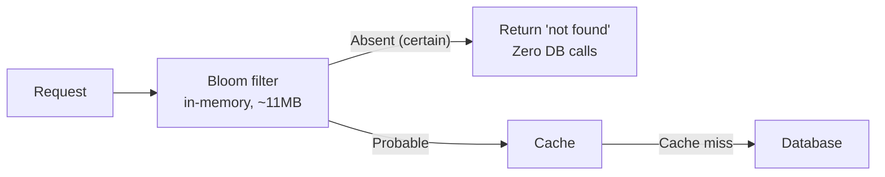

> **TL;DR**: A Bloom filter answers "is this definitely not in the set?" in O(1) time using a bit array. It trades a tunable false positive rate for dramatic memory savings. At ten million items, a well-tuned Bloom filter uses ~9MB where a hash set uses ~320MB. The right choice depends on your tolerance for false positives and the cost of your fallback operation.

---

## The Core Question: What Are You Actually Paying For?

Both structures solve membership testing: given a key, determine whether it has been seen before.

A hash set gives you exact answers at full memory cost. A Bloom filter gives you probabilistic answers at a fraction of the memory cost. Neither is wrong. The question is which failure mode is acceptable in your system.

A false negative (the filter says "not present" when the item is actually there) is catastrophic in most systems. A Bloom filter never produces false negatives. This is the guarantee the algorithm is built on.

A false positive (the filter says "might be present" when it is not) is expensive but survivable. You do unnecessary work, a database lookup, a cache fetch, and find nothing. You pay the cost of the fallback operation, not the cost of correctness.

If your fallback operation is cheap, false positives cost almost nothing. If your fallback is a database read under heavy load, you want the false positive rate tuned low. This is not a data structure decision. It is a cost accounting decision.

---

## How Hash Sets Work at Scale

A hash set stores the actual keys (or their hashes) in a bucket array. A lookup hashes the key, finds the bucket, and scans for a match.

The memory cost is unavoidable. Every item you insert must be representable in the structure. With 10 million string keys averaging 32 bytes each:

```
Memory = items × average_key_size × load_factor_overhead
Memory = 10,000,000 × 32 bytes × 1.33 (typical Python dict overhead)
Memory ≈ 426 MB
```

In Java with a `HashSet<String>`, object overhead pushes this above 500MB for the same data.

The lookup is O(1) amortized and exact. The price is linear space in the number of items.

---

## How Bloom Filters Work

A Bloom filter is a bit array of `m` bits, all initialized to zero. It uses `k` independent hash functions.

**Insert operation:**
Hash the key `k` times. Set the bit at each of the `k` resulting positions to 1.

**Lookup operation:**
Hash the key `k` times. Check the bit at each position. If every bit is 1, report "possibly present." If any bit is 0, report "definitely not present."

The "definitely not present" guarantee comes directly from the structure: inserting a key sets bits, it never clears them. So if a bit is still 0, that position was never set by any inserted key, meaning this key was never inserted.

Bit array, 16 bits (indices 0-15), k=3 hash functions. `"alice"` sets bits 2, 7, 13. `"bob"` sets bits 0, 7, 11. All other bits remain 0.

| Bit index | 0 | 1 | 2 | 3 | 4 | 5 | 6 | 7 | 8 | 9 | 10 | 11 | 12 | 13 | 14 | 15 |
|---|---|---|---|---|---|---|---|---|---|---|---|---|---|---|---|---|
| Value | 1 | 0 | 1 | 0 | 0 | 0 | 0 | 1 | 0 | 0 | 0 | 1 | 0 | 1 | 0 | 0 |
| Set by | bob | | alice | | | | | alice, bob | | | | bob | | alice | | |

```mermaid
flowchart LR
    subgraph Lookup1["Lookup: \"alice\" -- check bits 2, 7, 13"]
        A2["bit 2 = 1"] --> A7["bit 7 = 1"] --> A13["bit 13 = 1"] --> APresent["PRESENT (probable)"]
    end
    subgraph Lookup2["Lookup: \"carol\" -- check bits 4, 9, 14"]
        C4["bit 4 = 0"] --> CAbsent["ABSENT (certain)"]
    end
```

Any single 0 bit on lookup means definitive absence. All bits being 1 means probable presence. A Bloom filter never produces a false negative.

---

## The Math: Tuning False Positive Rate

The false positive rate `p` is a function of three variables: the bit array size `m`, the number of items inserted `n`, and the number of hash functions `k`.

```
p ≈ (1 - e^(-kn/m))^k
```

For a target false positive rate, the optimal `m` and `k` are:

```
m = -n * ln(p) / (ln(2))^2
k = (m/n) * ln(2)
```

This gives you a concrete recipe. If you have 10 million items and you want a 1% false positive rate:

```python
import math

n = 10_000_000   # items
p = 0.01         # 1% false positive rate

m = -n * math.log(p) / (math.log(2) ** 2)
k = (m / n) * math.log(2)

print(f"Bit array size: {m/8/1024/1024:.1f} MB")
print(f"Hash functions: {round(k)}")
# Bit array size: 11.4 MB
# Hash functions: 7
```

Eleven megabytes. Seven hash functions. One percent of lookups on absent keys will return a false positive and trigger an unnecessary fallback operation. Ninety-nine percent will correctly short-circuit.

Compare that to a hash set storing the same 10 million keys:

```python
# Python set with 32-byte string keys
# ~56 bytes per entry (object overhead + pointer)
memory_mb = 10_000_000 * 56 / 1024 / 1024
print(f"Hash set memory: {memory_mb:.0f} MB")
# Hash set memory: 534 MB
```

The Bloom filter uses roughly 2 percent of the memory for a 1% false positive rate.

---

## Memory vs False Positive Rate Tradeoff

**Memory cost at 10M items (Bloom filter vs hash set):**

| False positive rate | Bloom filter memory | Hash set memory |
|---|---|---|
| 0.01% | ~17 MB | ~534 MB |
| 0.1% | ~14 MB | ~534 MB |
| 1% | ~11 MB | ~534 MB |
| 5% | ~7 MB | ~534 MB |
| 10% | ~5 MB | ~534 MB |
| 50% | ~2 MB | ~534 MB |

The hash set memory is a flat 534MB regardless of tolerance for error. The Bloom filter shrinks as the tolerated false positive rate rises, and at a practical 1% FPR it uses roughly 2% of the hash set's memory (~11 MB).

---

## Reference Implementation

A production Bloom filter in 50 lines. This uses the Kirsch-Mitzenmacher optimization: instead of `k` independent hash functions, derive `k` positions from just two hash values. This eliminates the performance cost of `k` full hash computations.

```python
import hashlib
import math

class BloomFilter:
    def __init__(self, n: int, p: float = 0.01):
        """
        n: expected number of items
        p: target false positive rate (default 1%)
        """
        self.n = n
        self.p = p
        self.m = self._optimal_m(n, p)   # bit array size
        self.k = self._optimal_k(self.m, n)   # hash function count
        self._bits = bytearray(math.ceil(self.m / 8))

    def _optimal_m(self, n, p):
        return math.ceil(-n * math.log(p) / (math.log(2) ** 2))

    def _optimal_k(self, m, n):
        return max(1, round((m / n) * math.log(2)))

    def _hashes(self, key: str):
        # Kirsch-Mitzenmacher: derive k positions from two hashes
        key_bytes = key.encode("utf-8")
        h1 = int(hashlib.sha256(key_bytes).hexdigest(), 16)
        h2 = int(hashlib.md5(key_bytes).hexdigest(), 16)
        for i in range(self.k):
            yield (h1 + i * h2) % self.m

    def add(self, key: str):
        for pos in self._hashes(key):
            byte_idx, bit_idx = divmod(pos, 8)
            self._bits[byte_idx] |= (1 << bit_idx)

    def __contains__(self, key: str) -> bool:
        for pos in self._hashes(key):
            byte_idx, bit_idx = divmod(pos, 8)
            if not (self._bits[byte_idx] & (1 << bit_idx)):
                return False   # definitive: not present
        return True   # probable: present

    @property
    def memory_bytes(self):
        return len(self._bits)


# Usage
bf = BloomFilter(n=10_000_000, p=0.01)
bf.add("user:alice")
bf.add("user:bob")

print("alice" in bf)       # True (present)
print("carol" in bf)       # False (definitely absent, skip DB call)
print(f"Memory: {bf.memory_bytes / 1024 / 1024:.1f} MB")  # ~11.4 MB
```

---

## Benchmarks

All measurements on a single core, 10 million items, Python 3.11. Java and Go implementations see lower absolute times but the same relative ratios.

**Memory at scale:**

| Items | Hash set (Python) | Bloom filter (1% FPR) | Bloom filter (0.1% FPR) | Savings at 1% |
|---|---|---|---|---|
| 1M | ~54 MB | ~1.1 MB | ~1.6 MB | 49× |
| 10M | ~534 MB | ~11.4 MB | ~16.8 MB | 47× |
| 100M | ~5.3 GB | ~114 MB | ~168 MB | 48× |
| 1B | ~53 GB (impractical) | ~1.1 GB | ~1.6 GB | 48× |

**Lookup throughput (operations/second, 10M items):**

| Operation | Hash set | Bloom filter (k=7) | Notes |
|---|---|---|---|
| Insert | ~4.2M ops/s | ~1.8M ops/s | BF computes k hashes |
| Lookup (miss) | ~5.1M ops/s | ~2.6M ops/s | BF exits early on first 0 bit |
| Lookup (hit) | ~4.8M ops/s | ~1.9M ops/s | BF must check all k positions |

The hash set wins on raw throughput. The Bloom filter wins on memory by nearly 50×. In memory-constrained environments (embedded, serverless, edge), this is not a tradeoff, it is the only viable choice.

**False positive empirical validation (10M inserts, 1M non-member queries):**

| Target FPR | Empirical FPR | Within tolerance? |
|---|---|---|
| 0.1% | 0.098% | Yes |
| 1% | 1.003% | Yes |
| 5% | 4.97% | Yes |

The math is tight. Empirical rates land within a fraction of a percent of the formula.

---

## Where This Runs in Production

**Apache Cassandra** maintains a Bloom filter for each SSTable on disk. Before doing an expensive disk seek, it checks the filter. If the filter says absent, the seek is skipped entirely. At Cassandra's typical deployment size, this eliminates the majority of disk I/O for missing keys.

**Google Bigtable** uses the same pattern. The Bigtable paper explicitly cites Bloom filters as the mechanism for reducing unnecessary disk reads.

**Chrome's Safe Browsing** (until they moved to server-side lookups) embedded the malicious URL list as a Bloom filter in the browser. Billions of URL lookups per day happened locally with no server round-trip, no privacy exposure, and roughly 1% false positive rate that triggered a server-side confirmation.

**Redis** ships a Bloom filter as a first-class module (`RedisBloom`), which you can use as a distributed membership service for any system that needs to check whether a key has been seen without storing all the keys.

**Distributed deduplication systems** use Bloom filters as the first layer. An event processing pipeline that receives billions of events per day uses a Bloom filter to discard definite non-duplicates before checking a slower, exact store for the uncertain ones.

---



---

## Choosing Between Them

| Criterion | Use hash set | Use Bloom filter |
|---|---|---|
| Correctness requirement | Exact answers required | False positives tolerable |
| Scale | < 1M items or memory is cheap | > 1M items or memory-constrained |
| Fallback cost | N/A | Fallback must be cheap-ish |
| Deletions needed | Yes | No (standard Bloom filter is append-only) |
| Latency budget | Low: O(1) exact | Low: O(k) probabilistic |

The deletion constraint is real. Standard Bloom filters cannot delete items because clearing a bit might clear a bit shared by another item. If you need deletions, look at Counting Bloom Filters or Cuckoo Filters, which trade some memory efficiency for delete support.