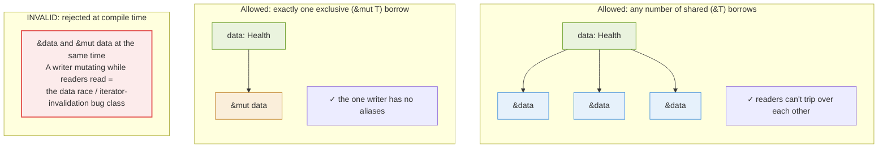
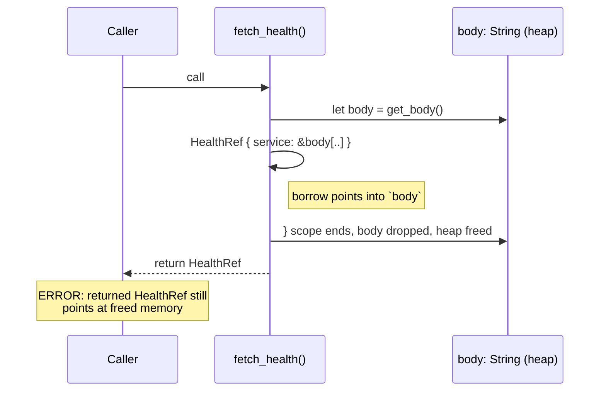

In [Part 1](/blogs/building-rust-tui-api-monitor-part-1-ownership) I learned that a value has one owner and that using it after a move is a compile error. That rule is strict but, honestly, easy. You move things, you stop touching the old name, you move on.

Then I tried to write a function that parses an API response and returns a piece of it. And Rust said this:

```text
error[E0515]: cannot return value referencing local variable `body`
  --> src/main.rs:14:5
   |
14 |     serde_json::from_str(&body).unwrap()
   |     ^^^^^^^^^^^^^^^^^^^^^^----^^^^^^^^^^^
   |     |                    |
   |     |                    `body` is borrowed here
   |     returns a value referencing data owned by the current function
```

This one took me a day. Not because the fix is hard, the fix is two characters, but because to understand *why* it's an error you have to hold the entire borrowing-and-lifetimes model in your head at once. This is the post where that model gets built, on top of a real task: turning a JSON health response into Rust data we can hold onto.

> **TL;DR**: A reference (`&T`) borrows a value without owning it. The rules: you may have *either* any number of shared borrows (`&T`) *or* exactly one exclusive borrow (`&mut T`), never both at once. Every reference has a *lifetime*, a region of code for which it is valid, and the compiler refuses to let a reference outlive the value it points to. That single guarantee eliminates dangling pointers and iterator invalidation at compile time. serde's zero-copy deserialization is the most useful place to feel all of this at once.

---

## The Series

1. [Part 1, Ownership and the borrow checker](/blogs/building-rust-tui-api-monitor-part-1-ownership)
2. **Part 2, Borrowing, lifetimes, and serde** *(you are here)*
3. [Part 3, Async, Tokio, and sharing state across tasks](/blogs/building-rust-tui-api-monitor-part-3-async-tokio-concurrency)
4. [Part 4, The TUI with ratatui, error handling, and RAII cleanup](/blogs/building-rust-tui-api-monitor-part-4-ratatui-error-handling)
5. [Part 5, Traits, iterators, zero-cost abstractions, and the release build](/blogs/building-rust-tui-api-monitor-part-5-traits-performance-release)

---

## Giving the Response Some Shape

So far `pulse` only reads the status line. A real monitor wants structured data. Say each service exposes a health endpoint that returns JSON like this:

```json
{ "service": "auth", "status": "ok", "latency_ms": 42 }
```

To turn that text into a typed Rust value we use **serde**, the serialization framework that the entire ecosystem standardizes on. Two crates:

```toml
[dependencies]
reqwest = { version = "0.12", features = ["blocking"] }
serde = { version = "1", features = ["derive"] }
serde_json = "1"
```

Describe the shape with a struct and let serde generate the parser:

```rust
#[derive(Debug, serde::Deserialize)]
struct Health {
    service: String,
    status: String,
    latency_ms: u32,
}

fn main() {
    let body = reqwest::blocking::get("https://example.test/health")
        .unwrap()
        .text()
        .unwrap();                       // `body` is a String we own

    let health: Health = serde_json::from_str(&body).unwrap();
    println!("{health:?}");
}
```

`#[derive(Deserialize)]` is a macro that writes the field-by-field parsing code for you at compile time. There is no reflection, no runtime schema walking, by the time the program runs, `from_str` is monomorphized machine code that knows exactly how to fill a `Health`. This works and it owns its data: each `String` field is a fresh heap allocation copied out of `body`. Fine for three fields. But it copies every string, and that nagged at me, because the bytes are *right there* in `body` already.

---

## Borrowing: Looking Without Taking

A reference lets you access a value without owning it. You write `&value` to create one and `&Type` for the type. The function from Part 1 took `&Target` precisely so it could read a target without consuming it.

There are two kinds, and the distinction is the whole game:

- `&T`, a **shared** (immutable) borrow. Read-only. You can have as many as you want at the same time.
- `&mut T`, an **exclusive** (mutable) borrow. Read-write. You can have exactly one, and no shared borrows may coexist with it.

This is the borrowing rule, and it is worth stating as a slogan: **shared XOR mutable**. Many readers, or one writer, never both. The compiler enforces it everywhere, always.



Why be this strict? Because the dangerous bug is exactly the forbidden case: something reads a value while something else mutates it. Here's that bug, and how the compiler stops it before it can exist:

```rust
let mut targets = vec![
    String::from("auth"),
    String::from("billing"),
];

let first = &targets[0];     // shared borrow of an element
targets.push(String::from("search")); // wants &mut targets -> ERROR
println!("first service: {first}");
```

```text
error[E0502]: cannot borrow `targets` as mutable because it is also
              borrowed as immutable
```

In C++ this compiles and is a landmine. `push` may need a bigger backing buffer; if it reallocates, every existing reference into the vector, including `first`, now points at freed memory. Reading `first` afterward is undefined behavior. In Python or Java you don't get the dangling pointer, but mutating a collection while iterating it throws at runtime if you're lucky and silently corrupts your logic if you're not. Rust turns the entire family of "mutate-while-aliased" bugs into a compile error. You reorganize the code; you never ship the crash.

---

## Slices: Borrowing a Window

A reference doesn't have to point at a whole value. A **slice** borrows a contiguous run of one. `&str` is a slice into a `String`'s bytes; `&[T]` is a slice into a `Vec<T>`'s elements. They're just a pointer and a length, no allocation, no copy.

```rust
let url = String::from("https://example.test/health");
let scheme: &str = &url[0..5];   // borrows "https", points into url's buffer
```

`scheme` owns nothing. It is a (pointer, length) pair aimed at the middle of `url`'s heap buffer. Which raises the obvious, dangerous question: what happens if `url` gets dropped while `scheme` is still around? That question is what lifetimes exist to answer.

---

## Lifetimes: How Long a Borrow Is Valid

A lifetime is the span of code during which a reference is guaranteed to point at something alive. Most of the time the compiler infers it and you never write a thing. It surfaces when you write references whose validity it can't figure out on its own, most commonly, returning a reference from a function.

Here is the error from the top of the post, in full. I wanted a helper that fetches and parses in one step, returning a borrowed view:

```rust
#[derive(Debug, serde::Deserialize)]
struct HealthRef<'a> {
    service: &'a str,
    status: &'a str,
    latency_ms: u32,
}

fn fetch_health() -> HealthRef {       // returns a borrow... of what?
    let body = get_body();             // local String, owns the bytes
    serde_json::from_str(&body).unwrap()
} // <- `body` is dropped here
```

`HealthRef` doesn't copy strings; its `&'a str` fields *borrow* slices out of the JSON text. The `<'a>` is a lifetime parameter, it says "this struct holds references that live for some region `'a`, and the struct must not outlive it." So `fetch_health` is trying to return a value that borrows from `body`, and then drops `body` on the way out. The returned reference would point at freed memory. That's a dangling pointer, and it's the single most exploited bug class in systems software. The compiler refuses:

```text
error[E0515]: cannot return value referencing local variable `body`
```



The compiler proves the returned reference would outlive `body` and rejects the function. In C this compiles silently and is a use-after-free. In Rust it never builds.

There are two honest fixes, and choosing between them is the same trade-off from Part 1 wearing a new outfit.

**Fix A, own the data.** Use the `Health` struct with `String` fields. It copies the bytes out, so it depends on nothing once parsed and can be returned freely. Costs allocations.

```rust
fn fetch_health() -> Health {                 // owns everything
    let body = get_body();
    serde_json::from_str(&body).unwrap()       // copies strings out of body
} // body drops, but Health doesn't point into it, fine
```

**Fix B, let the caller own the buffer.** Keep the zero-copy `HealthRef`, but take the buffer as a borrowed argument so its lifetime is the caller's problem, not ours. The `'a` ties the output to the input: the result lives as long as the buffer does.

```rust
fn parse_health<'a>(body: &'a str) -> HealthRef<'a> {
    serde_json::from_str(body).unwrap()        // borrows slices of `body`
}

fn main() {
    let body = get_body();                     // caller owns the buffer
    let health = parse_health(&body);          // borrows into it
    println!("{health:?}");                    // valid: body still alive here
} // body drops last, after health: order is correct
```

That `<'a>` is the entire lifetime syntax most people ever need. It's not describing *how long* anything lives in seconds; it's describing a *relationship*: "the returned reference is valid for the same region as the input." The compiler checks the relationship holds at every call site.

---

## Owned vs Borrowed: The Decision You'll Make Constantly

Zero-copy parsing is genuinely faster, serde can deserialize a `HealthRef` borrowing straight out of the network buffer with zero string allocations. But the borrow chains you to the buffer's lifetime. Owned parsing costs allocations but the result is self-contained. This is one of the most common design decisions in Rust, and there is no universal right answer:

| | Borrowed (`&'a str` fields) | Owned (`String` fields) |
|---|---|---|
| Allocations on parse | Zero | One per string field |
| Can outlive the source buffer | No, tied to its lifetime | Yes, fully independent |
| Can be stored in a long-lived struct | Awkward (lifetime spreads everywhere) | Easy |
| Best for | Parse, read, discard in one scope | Keep, move between threads, store |

For `pulse`, the parsed health data needs to survive across refresh cycles and, spoiler for Part 3, get sent between threads. That makes the answer easy: **own it.** The `Health` struct with `String` fields is what we keep. The zero-copy version was worth building only to understand why we're *not* using it, and to feel where lifetimes come from.

This is a recurring rhythm in Rust. You reach for the clever borrowed version, the lifetime requirements infect everything that touches it, and you back off to owned data because the ergonomics are worth a few allocations. Knowing *when* the clever version pays off, hot parse loops, huge payloads, is most of the skill.

---

## Where We Are

`pulse` now parses real structured responses into typed Rust values, and we've met the second pillar of the language:

- A reference **borrows** without owning. **Shared XOR mutable**: many `&T` or one `&mut T`, never both.
- That rule kills data races and iterator invalidation at compile time.
- A **slice** (`&str`, `&[T]`) borrows a window into a value with no copy.
- Every reference has a **lifetime**; the compiler forbids a reference from outliving its referent, which is why returning a borrow of a local fails.
- **Owned vs borrowed** is a constant, deliberate trade-off. For data that must travel and persist, own it.

We've been making one request at a time and blocking the whole program while the network does its thing. A monitor watching a dozen services that way would spend most of its life asleep waiting on sockets, one at a time. The fix is concurrency, poll everything at once, and concurrency is where Rust's ownership rules go from helpful to genuinely magic. The compiler can prove your threads don't race.

**Next:** [Part 3, Async, Tokio, and sharing state across tasks](/blogs/building-rust-tui-api-monitor-part-3-async-tokio-concurrency), where `Send`, `Sync`, and `Arc<Mutex<T>>` turn "fearless concurrency" from a slogan into something you can feel.
