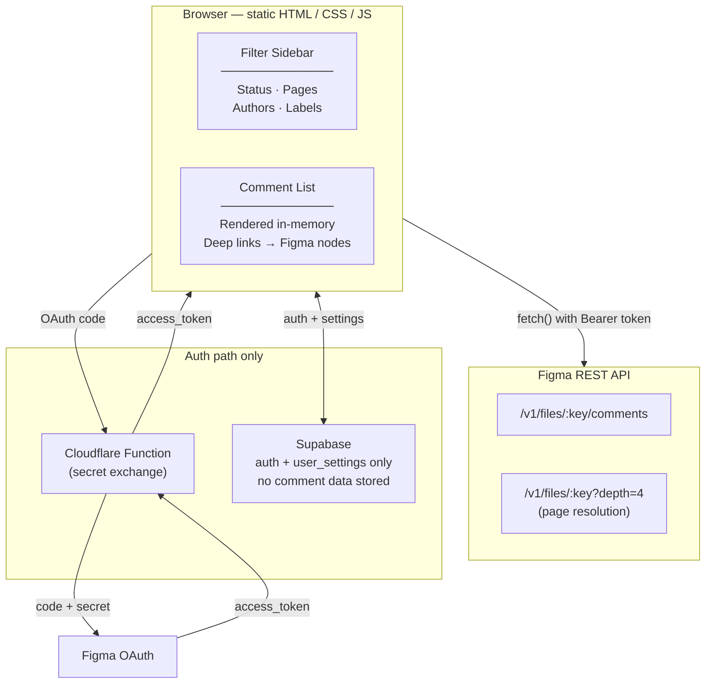

I built a Figma comment dashboard and made one decision that surprised every dev I showed it to: no backend comment storage at all.

Comments are fetched live from the Figma REST API on every load. Supabase handles auth and user settings only. Everything else, filtering, rendering, label detection, runs in the browser. No database of comments, no sync pipeline, no webhooks.

This post is about why, how, and where it bit me.

## The Architecture



## The problem

Design teams lose track of feedback the moment they have more than two active Figma files. Comments scatter across pages. Nobody knows what is open versus resolved without opening every file by hand. I wanted one dashboard that pulls every comment from a file and makes it filterable and actionable.

The obvious build: fetch comments, store them in Postgres, serve from your own API. That gets you history, cross-file analytics, and server-side notifications. It also gets you a sync pipeline, stale-data edge cases, and infrastructure that scales with usage.

I went the other way.

## The core decision: no comment storage

Every comment fetch is a direct browser-to-Figma call. Supabase holds one row per user in a `user_settings` table: their saved file keys and UI preferences. The comment content never touches my servers.

| | Option A: store comments in DB | Option B: live fetch, no storage |
|---|---|---|
| Data freshness | Stale between syncs | Always matches Figma exactly |
| History / analytics | Full history | None |
| Notifications | Server-side push possible | Not possible |
| Infrastructure | Sync pipeline, webhooks, storage | 1 Cloudflare Function, 1 Supabase project |
| Storage cost | Scales with usage | Zero |
| Complexity | High | Low, stateless reads |

For the actual use case, triage during an active sprint or a handoff review, freshness beats history. You want to know what is open right now, not what the comment thread looked like at last night's sync. The missing features are nice-to-have, not core. So the constraint that looks like a limitation is actually aligned with the workflow.

That is the whole argument: pick the constraint that matches the job, and the architecture gets simpler for free.

## Figma OAuth without leaking the secret

The OAuth code-for-token exchange needs a client secret. A client secret cannot live in browser JavaScript, it would be readable in source. That single requirement is the only reason this project has a backend at all.

The entire server side is one Cloudflare Function:

```javascript
// figma-token.js — the only server-side code in the project
export default {
  async fetch(request, env) {
    if (request.method !== "POST") {
      return new Response("Method Not Allowed", { status: 405 });
    }

    const { code, redirect_uri } = await request.json();
    if (!code || !redirect_uri) {
      return new Response("Missing required fields", { status: 400 });
    }

    // Exchange code for token. The client secret never leaves this function.
    const tokenResponse = await fetch("https://api.figma.com/v1/oauth/token", {
      method: "POST",
      headers: { "Content-Type": "application/x-www-form-urlencoded" },
      body: new URLSearchParams({
        client_id: env.FIGMA_CLIENT_ID,
        client_secret: env.FIGMA_CLIENT_SECRET,
        redirect_uri,
        code,
        grant_type: "authorization_code",
      }),
    });

    if (!tokenResponse.ok) {
      const error = await tokenResponse.text();
      return new Response(JSON.stringify({ error }), {
        status: tokenResponse.status,
        headers: { "Content-Type": "application/json" },
      });
    }

    const tokenData = await tokenResponse.json();
    return new Response(JSON.stringify({ access_token: tokenData.access_token }), {
      headers: {
        "Content-Type": "application/json",
        "Access-Control-Allow-Origin": env.ALLOWED_ORIGIN,
      },
    });
  },
};
```

To be precise about the trust model, since this is the part people ask about: the function protects the client secret, nothing more. The access token it returns lives in the browser and is used to call the Figma API directly. That is a deliberate tradeoff for a client-side tool, the same posture a Figma plugin or a personal-access-token workflow has. It is the right call for a single-user dashboard and the wrong call for a multi-tenant SaaS that needs to act on users' behalf server-side. Worth naming the boundary rather than implying the function is doing more than it is.

## Page name resolution, the interesting part

This was the problem worth solving. Figma's comment API returns a `node_id` per comment, but it does not tell you which page that node lives on. To build a Pages filter, I needed to map every `node_id` to its parent page.

The approach: fetch the file tree, traverse it once, tag every descendant with its page name.

```javascript
async function buildNodeToPageMap(fileKey, accessToken) {
  const response = await fetch(
    `https://api.figma.com/v1/files/${fileKey}?depth=4`,
    { headers: { Authorization: `Bearer ${accessToken}` } }
  );
  const { document } = await response.json();

  const nodeToPage = new Map();
  for (const page of document.children) {
    if (page.type !== "CANVAS") continue;
    tagNodes(page, page.name, nodeToPage);
  }
  return nodeToPage;
}

function tagNodes(node, pageName, map) {
  map.set(node.id, pageName);
  if (node.children) {
    for (const child of node.children) {
      tagNodes(child, pageName, map);
    }
  }
}

function resolveCommentPage(comment, nodeToPage) {
  if (!comment.client_meta?.node_id) return "Global"; // file-level comments
  return nodeToPage.get(comment.client_meta.node_id) ?? "Unknown Page";
}
```

It runs once per file load, `O(n)` in node count, imperceptible for normal files. The map stays in memory for the session.

## Where it bit me

`depth=4` is the catch. I picked it to keep the file-tree payload small, and for most files it is plenty. But a comment can be pinned to a node nested deeper than four levels, inside a component inside a frame inside a group. When that happens, the node is not in the tree I fetched, the map lookup misses, and the comment falls through to "Unknown Page" instead of its real page.

On real client files with heavy component nesting this showed up more than I expected. The honest fix is depth-on-demand: fetch shallow first, then re-fetch a deeper slice only for the nodes that missed. I have not shipped that yet. For now "Unknown Page" is a known gap rather than a bug, and the comment is still fully usable, it just lands in the wrong filter bucket. Naming it here because every "fetch the tree and traverse it" tutorial skips the part where the tree is intentionally truncated.

## Auto-label detection

Labels (Bug, Approved, Urgent, Question, Done, Mention) are detected from comment text. No tagging from the user.

```javascript
const LABEL_PATTERNS = {
  Bug:      /\b(bug|broken|fix|error|crash|issue|wrong)\b/i,
  Approved: /\b(approved?|lgtm|looks good|ship it|good to go)\b/i,
  Urgent:   /\b(urgent|asap|blocker|critical|immediately|priority)\b/i,
  Question: /\?|^(what|why|how|when|where|who|can you|should we)/im,
  Done:     /\b(done|fixed|resolved|addressed|completed)\b/i,
  Mention:  /@\w+/,
};

function detectLabels(commentText) {
  return Object.entries(LABEL_PATTERNS)
    .filter(([, pattern]) => pattern.test(commentText))
    .map(([label]) => label);
}
```

A comment can match multiple patterns, and that is correct: "looks good but there is a bug here?" gets Approved, Bug, and Question. The false-positive rate on real comments is low enough to be worth the zero user overhead.

## Filter logic

Filters combine as OR within a dimension, AND across dimensions.

```javascript
function applyFilters(comments, filters) {
  return comments.filter(comment => {
    if (filters.status === "open" && comment.resolved_at) return false;
    if (filters.status === "resolved" && !comment.resolved_at) return false;
    if (filters.status === "recent") {
      const sevenDaysAgo = Date.now() - 7 * 24 * 60 * 60 * 1000;
      if (new Date(comment.created_at).getTime() < sevenDaysAgo) return false;
    }

    if (filters.pages.size > 0) {
      const commentPage = resolveCommentPage(comment, nodeToPage);
      if (!filters.pages.has(commentPage)) return false;
    }

    if (filters.authors.size > 0 && !filters.authors.has(comment.user.handle)) {
      return false;
    }

    if (filters.labels.size > 0) {
      const commentLabels = new Set(detectLabels(comment.message));
      const matchesAny = [...filters.labels].some(l => commentLabels.has(l));
      if (!matchesAny) return false;
    }

    return true;
  });
}
```

"Show me Bug or Urgent comments on the Login or Onboarding pages" is the natural query. A pure AND across everything would make any multi-select combination return nothing.

## Why no framework

Plain HTML, CSS, and vanilla JS. No webpack, no Vite, no npm install. The Supabase client loads from a CDN. Local dev is `python3 -m http.server`. Deploy is pushing static files.

This is not an argument against React. It is a context-specific call. The codebase is under 2,000 lines, there is no component reuse worth a component model, the rendering is a list and some filter clicks, and the deploy target is a CDN. When the honest answer to "do I need React" is "I need to render a list and respond to clicks," you do not need React.

## What I would do differently

If I rebuilt it: depth-on-demand for the page map from day one, so "Unknown Page" never appears. And I would decide the storage question per-feature rather than globally, the no-storage constraint is right for triage but the moment someone asks for "what changed since last week," Option B has no answer, and I would want a clean seam to add a thin history layer without rearchitecting.

The transferable lesson is the constraint-first instinct. In bigger systems the urge to add infrastructure "for when we need it" creates maintenance burden before the need is real. Start from the constraint that matches the job and the system stays lean until something genuinely forces it to grow.

Live at [comment-tracker.xyz](#). Free during early access. Feedback from the dev side welcome, especially on the depth-on-demand approach if you have solved this against the Figma API before.