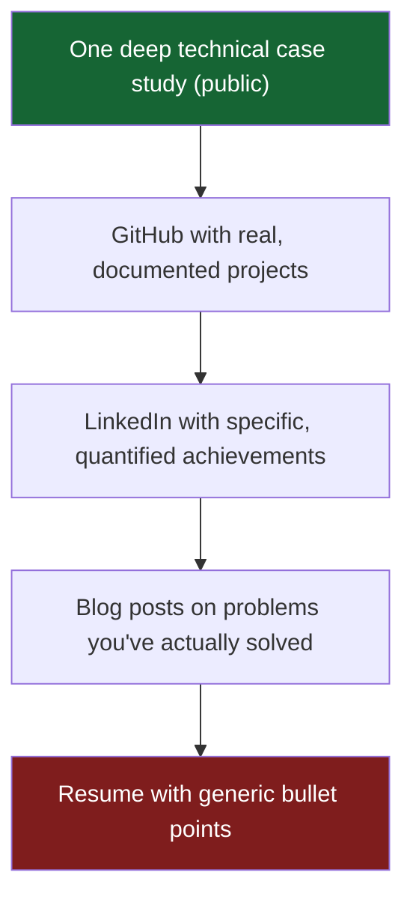

I've talked to developers with five years of production experience who can't land a $3,000/month remote contract. And I've seen developers with two years of experience charging $150/hour because three thousand people follow their build-in-public thread.

The difference is not skill. It's visibility.

> **TL;DR**: Skilled developers stay invisible because their best work lives behind NDAs and private repos, with nothing Googleable a recruiter or client can evaluate in 30 seconds. Recruiters and CTOs can't assess skill directly, so they use proxies, and one deep public case study beats ten resume lines because it's searchable, shareable, and self-validating. Write the case study, then keep writing: the compounding from 30 to 180 days is what turns skill into inbound.

---

## The Visibility Paradox

Software engineering has a visibility paradox: the most technically capable people are often the worst at making their work legible to the people who would pay for it. They work on impressive systems that live inside private repositories, company intranets, and NDAs. They have no artifacts. Nothing Googleable. Nothing a recruiter, startup CTO, or potential client can evaluate in 30 seconds.

Meanwhile, the developer who writes "here's what I learned building a to-do app in React" every week for six months has 2,000 followers and gets DMs from people asking if they're available for work.

This is not unfair. It's how reputation has always worked. The craftsman who builds in a closed workshop and the craftsman who builds in the town square will get different amounts of business, regardless of who makes the better chair.

## Your Code Is Not Your Portfolio

Nobody cares what's on your local machine. Nobody cares about the impressive system inside an NDA. What matters is: can someone Google your name, find your work, and form a confident opinion about what you can do in under 60 seconds?

The visibility stack, ordered by ROI:

A single case study, "here is the system I built, the problem it solved, the architecture I chose, what I'd do differently", is worth more than ten resume lines. It proves you can think, communicate, and build. Resumes claim all three. Case studies demonstrate them.

## The Fix

It's not complicated. It just feels uncomfortable.

Write one case study about the most interesting system you've built. Put it somewhere public. Tell the story of the problem, your approach, and the result. That one document is worth more than ten updated resume lines because it's searchable, shareable, and self-validating.

Then keep writing. Build the habit. The compounding is real:

- 30 days: you have a body of work
- 90 days: search engines start surfacing your name for your topics
- 180 days: inbound interest from people who found you through your writing

Recruiters and CTOs don't have time to evaluate skill directly. They use proxies. Writing is the highest-signal proxy available to a developer who hasn't shipped a famous open-source project.

> Your skills got you here. Visibility gets you where you want to go.

---

**Not sure where to start?**

The hardest part is picking which project to write about first. If you have the work but not the artifact, the [Grimms case study](/blog/legacy-system-modernization-vbnet-nuxtjs-case-study) is a template for the format. Pick your most interesting production system and write the same story. That one document is the beginning of inbound.
