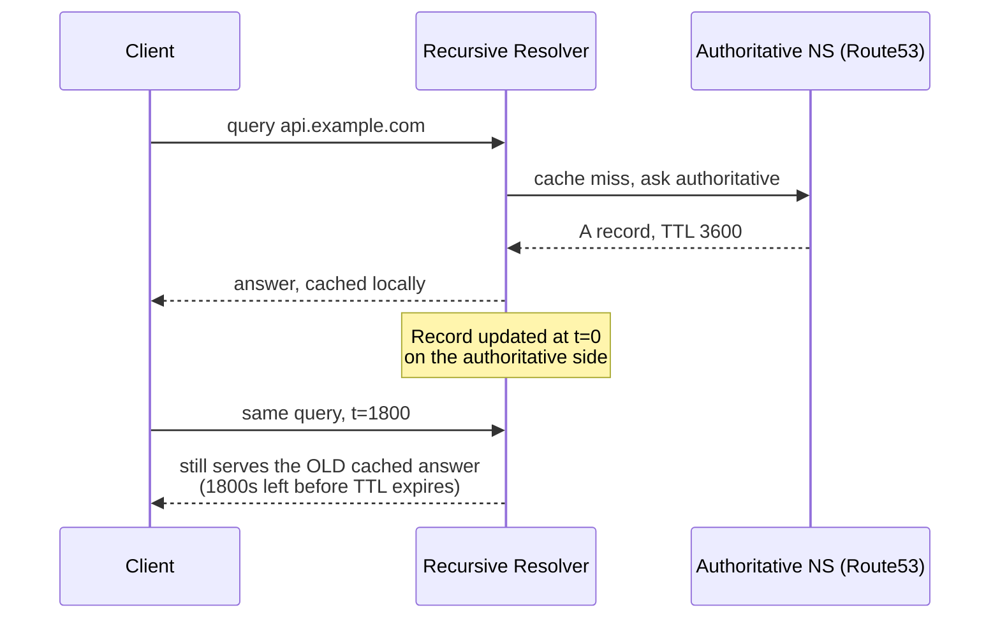
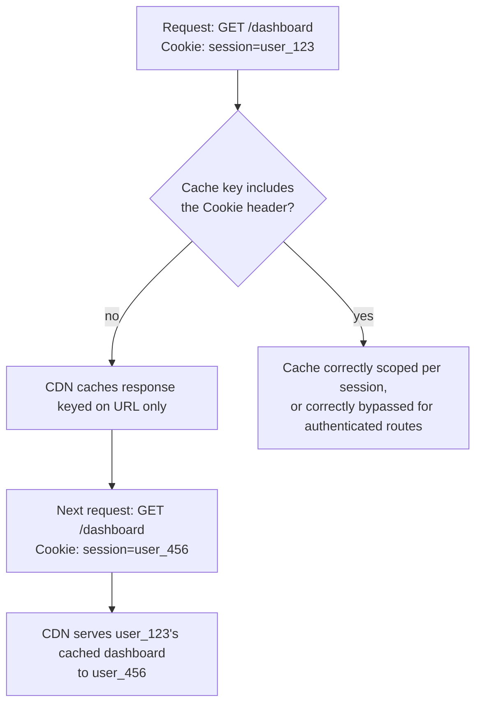

Part 1 was the security group. Part 2 went under it, into iptables, nftables, and conntrack. Part 3 went one layer further, into what a load balancer actually does to a connection before your instance ever sees it. Each post found the same shape: a layer that's fully correct on its own, reviewed by whoever built it, and a gap sitting at the handoff to the layer next to it.

This part goes earlier than all three. Before a security group evaluates anything, before a load balancer terminates or passes through a connection, something already decided which IP address the client's request goes to at all, and whether it even reaches your infrastructure or gets answered from a cache sitting on the other side of the planet. That decision is made by DNS and, in front of it, the CDN edge. Neither shows up in a security group audit. Neither shows up in a target group health check. By the time traffic reaches either of those, the routing decision has already happened, upstream, owned by a system nobody in the last three posts' audits ever looked at.

## DNS Resolution Is a Cache, Not a Lookup

The mental model most engineers carry, "DNS resolves a name to an IP," is true and almost useless, because it hides where the actual behavior lives: TTL.

A DNS record isn't fetched fresh on every request. A resolver, whether it's the OS stub resolver, a corporate DNS server, or an ISP's recursive resolver, fetches the record once and holds onto it for however many seconds the TTL says, answering every subsequent query from that cached copy without touching your authoritative nameserver again. Change the record, and every resolver holding a cached copy keeps serving the old answer until its TTL expires, regardless of what your Route53 console or your `dig` command shows right now.

```
$ dig api.example.com +noall +answer

api.example.com.    287    IN    A    203.0.113.42
                     ^^^
                     seconds remaining before any resolver
                     holding this record is required to ask again
```

This is the first place the ownership gap in this layer actually lives. A TTL set to a large value during initial setup, for good reasons at the time (fewer queries, lower latency, lower cost), turns into a liability the moment you need to move traffic quickly, during a failover, a provider migration, or an incident. A TTL of 3600 seconds means some fraction of your traffic keeps hitting the old IP for up to an hour after you've already fixed the problem at the DNS layer, and nothing in the DNS record itself tells you that's happening. The record looks correct. It's the caches you don't control that are stale.



The practical rule this leads to: **lower your TTL before you need to lower it, not during the incident where you discover it's too high.** A TTL of 60 seconds on records you expect to ever need to move fast costs you almost nothing in additional query volume for most workloads, and it's the single cheapest insurance against a slow failover. Raising it back up once things are stable is free. Discovering during an outage that your failover record won't actually take effect for another 55 minutes is not.

## The CDN Edge Decides Whether Origin Even Sees the Request

Once resolution lands the client somewhere, if that somewhere is a CDN edge, a second, entirely separate decision happens: does this request get answered from cache, or does it get forwarded to origin?

This is where a class of bugs lives that looks nothing like a normal application bug, because the application never runs. A cache rule that's too permissive serves stale content to users who should be seeing something fresh, a price that changed an hour ago, a piece of content that was supposed to be taken down, a personalized response served to the wrong person because the cache key didn't include something it should have (a cookie, an auth header, a query parameter). None of this is visible from application logs, because the application was never invoked. The edge answered on its own.

```
Cache-Control: public, max-age=3600, s-maxage=86400
                                     ^^^^^^^^^^^^^^^^
                                     the CDN's own cache lifetime,
                                     separate from and often longer
                                     than the browser's max-age
```

`max-age` governs how long a browser caches the response. `s-maxage` governs how long a shared cache, the CDN, holds it, and it's routinely set far more aggressively than the browser value because someone reasoned about origin load and never revisited what that meant for how fast a change actually reaches users. An `s-maxage` of 86400 means a cache purge is now a manual, remembered step in every deploy that changes cached content, and the failure mode when someone forgets is silent: the site looks fine, just wrong, for up to a day, to some fraction of visitors depending on which edge location served them.

**The cache key is the part that causes the worse bugs.** By default, most CDNs key their cache on the URL alone. If your origin returns different content for the same URL based on a header, a cookie, or the `Accept-Language` value, and that header isn't part of the cache key, the first response the CDN sees for a given URL gets served to everyone else who hits that URL next, regardless of what their own request actually asked for. This has shipped one user's personalized dashboard to a different user in production more than once, industry-wide, and it never shows up as an error. It shows up as a support ticket that says "I'm seeing someone else's data," which is a much worse first sentence to read than a stack trace.



The fix isn't complicated once it's visible: anything that varies the response per user should either be excluded from CDN caching entirely (a `Cache-Control: private, no-store` on authenticated routes) or included explicitly in the cache key via a `Vary` header or the CDN's own cache-key configuration. What makes this an ownership gap rather than a simple bug is that it's invisible in every layer this series has already covered. The security group is fine. The load balancer's health checks pass. The application code, if you read it in isolation, is correct. The gap is entirely in a caching decision made at a layer between the client and everything else, configured once, and never audited again because nobody's job description includes "review the edge cache key."

## Origin Shield and the Thundering Herd Nobody Sees

A related failure shows up specifically when a cached object expires. If a popular URL's cache entry lapses at exactly the moment a spike of traffic hits it, every one of those requests can miss cache simultaneously and all forward to origin at once, a cache stampede. Origin, which has been happily idle because the CDN was absorbing 99.9% of traffic, suddenly gets hit with the full uncached request volume in the same second the cache expired, and looks like it fell over for no reason.

Most CDNs have a mechanism for this, usually called origin shield or request collapsing: only the first request for an expired object goes to origin, and every other request for the same object that arrives while that fetch is in flight waits for the result instead of independently forwarding. Whether this is enabled is a configuration flag, not a default in every CDN or every distribution, and it's the kind of setting that only matters the day traffic is high enough to expose its absence, which is exactly the day you don't want to be discovering it.

## DNS Failover Is Untested Until It's Tested

Route53 and equivalent services support health-checked failover records: point primary traffic at one endpoint, define a health check, and automatically fail over to a secondary record if the primary starts failing. This is the mechanism most teams point to as their disaster recovery story for the DNS layer.

It's also the mechanism most likely to be silently broken, because it's exercised so rarely that a configuration drift, an expired health check credential, a secondary environment that quietly fell out of sync with primary, goes unnoticed for months. A failover record that hasn't actually failed over since the migration that created it isn't a tested safety net. It's an assumption wearing a health check's clothing.

```bash
# Route53 health check status: is the check actually passing right now,
# and has it changed state recently in a way nobody noticed?
aws route53 get-health-check-status --health-check-id <id>

# When did this health check last change state? A failover that's
# never fired in six months is untested, not proven safe.
aws route53 get-health-check --health-check-id <id> \
  --query 'HealthCheck.HealthCheckConfig'
```

The only way to know a failover record actually works is to have caused it to fire on purpose, on a schedule, the same discipline as a restore test for a backup. A DNS failover you've never triggered is a hypothesis, not a capability.

## Auditing This Layer

```bash
# Current TTL on a record, and whether it matches what you'd want
# during an incident rather than what was convenient at setup time
dig api.example.com +noall +answer

# What's actually being served, and by whom, right now, bypassing
# any local resolver cache to see the authoritative answer directly
dig api.example.com @<authoritative-ns> +noall +answer

# Cache behavior headers on a live response: what is the CDN actually
# doing with this, not what you assume the config says it does
curl -sI https://example.com/some-path | grep -iE 'cache-control|age|x-cache|cf-cache-status|x-vercel-cache'

# Does the cache key vary on the things that should make it vary?
# Two requests, same URL, different cookie, compare the response bodies
curl -s -H 'Cookie: session=test_a' https://example.com/dashboard
curl -s -H 'Cookie: session=test_b' https://example.com/dashboard
```

The `x-cache` or provider-specific cache-status header on a real response is worth checking before trusting anything the dashboard says the rule should do. `HIT` versus `MISS` on a request that should have been personalized, or on a request made seconds after a deploy that changed the content, tells you directly whether the cache layer is behaving the way the configuration implies it should, rather than the way it was configured to eight months ago before someone else changed something adjacent.

## The Case That Keeps Repeating

A team ships a fix, confirms it in the origin logs, confirms the deploy succeeded, and still gets reports that the old behavior is happening for some users. Security groups are fine. Load balancer target health is green. The application code deployed is the new code, verified directly on the instance. And still, some slice of traffic sees the old response.

The actual cause, close to every time: either a DNS TTL from a prior configuration hasn't expired yet on some resolvers, so some clients are still resolving to an old endpoint entirely, or a CDN cache entry with a long `s-maxage` was never purged as part of the deploy, so the edge is confidently serving a cached response from before the fix existed. Neither shows up in an origin-side investigation, because origin is doing exactly what it was told. The gap is a layer earlier, in a system whose entire job is to reduce how often anything has to ask origin a question, which is precisely why it's the last place anyone looks when origin's answer changed and the world didn't seem to notice.

## Where the Ownership Gap Actually Sits

Four layers into this series, the pattern holds without exception. Security group to OS firewall. OS firewall to load balancer. Load balancer to the instance behind it. And now, earlier than any of them, DNS and the CDN edge to the load balancer that never even sees the request if the edge answers it first. Every one of these is a boundary where both sides can be independently, verifiably correct, and the gap between them still swallows the thing nobody thought to check.

A TTL set once, for good reasons, at a time when nobody was thinking about how fast it would need to change later. A cache rule that correctly reduces origin load and just as correctly serves the wrong thing to the wrong person because the key didn't account for what actually varies. A failover record that has never once been asked to do its job. None of these are misconfigurations in the sense of being wrong when they were written. They're correct answers to a question that stopped being the right question to ask, at a layer with its own owner, its own console, its own sense of being handled, that isn't in the room when the layer next to it gets audited.
