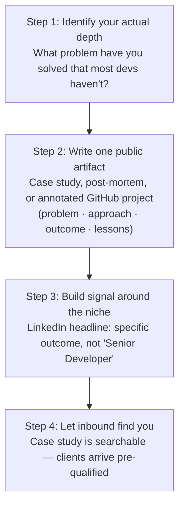

"Freelance dev is dead. Upwork is a race to the bottom. The market is saturated."

I hear this constantly. It's partially true and mostly wrong.

The race-to-the-bottom market is real — for generic web development. "I build React apps and REST APIs" is a commodity in 2025. There are tens of thousands of engineers globally who can do that at lower rates than you. Competing in that market is a losing game.

But that's not the freelance market. That's one undifferentiated tier of it.

## The Two Freelance Markets

They look the same from the outside. They're completely different in practice.

| | Market A: Commodity Development | Market B: Specialist Consulting |
|---|---|---|
| Client need | "We need a React developer to implement these Figma designs" | "We have a 15-year-old system we can't maintain and can't afford to break. We need someone who has done this before." |
| Competition | Global, price-sensitive, hundreds of bids | Few people with this specific track record |
| Differentiator | Price, speed, reviews | Demonstrated experience, trust signals, specific outcomes |
| Rate ceiling | $30–60/hr in 2025 | $100–200/hr, sometimes project-based at multiples |
| AI exposure | High — generalist work is exactly what AI does well | Low — requires domain context and accountability |

The clients in Market B are not comparing you to the lowest bidder. They're comparing you to the cost of the problem continuing to exist. A business running on a broken legacy system is losing money every day. That framing changes the entire price conversation.

## The Positioning Move

The move is not complicated but it requires discipline.

Pick the problem you've solved that most developers haven't touched. For me, that's legacy system modernisation, BLE mesh mobile architecture, and AI agent implementation. I can write a case study for each that demonstrates the problem, my approach, and the outcome.

That case study is not a portfolio piece. It's a trust signal for a very specific client who has exactly that problem. When a business owner Googles "VB.NET to web migration" and finds a detailed technical post-mortem with real performance numbers, they're not reading a blog. They're evaluating a vendor.

The positioning stack:

## What Changes When You Specialise

The conversation changes entirely. You stop bidding on jobs. You start being invited to solve problems.

The client who finds your legacy migration case study and contacts you is not asking "what's your hourly rate?" They're asking "have you done this before?" and "can you not break our business?" Those are questions you can answer credibly. Price is almost an afterthought.

> The freelance market is not saturated. The "I can build anything" market is. Those are not the same thing.

Your niche doesn't need to be obscure. It needs to be specific and credibly demonstrated. That's the entire positioning game.

freelance-developer-market-positioning-remote-work-strategy.md