Every startup wants a full-stack developer. Someone who can do the database, the API, the frontend, the CI/CD pipeline, the cloud infrastructure, the mobile app, and review the security audit on weekends.

This is not a job description. It's a budget problem disguised as a job description.

## What "Full-Stack" Actually Means

"Full-stack developer" as typically advertised means: "we want to pay one salary for three roles." And engineers — desperate to seem versatile, afraid of being pigeonholed — claim the title enthusiastically.

But here's the structural problem: expertise is depth. You cannot have senior-level depth in React state management, database query optimization, Kubernetes networking, and iOS Swift concurrency simultaneously. The human brain doesn't work that way. Time doesn't work that way.

The honest version of what "full-stack" describes:

| Role expected | Actual discipline |
|---|---|
| Database design and query optimization | DBA-level skill |
| REST and GraphQL API design | Backend engineer skill |
| React/Vue/Angular frontend | Frontend engineer skill |
| Mobile apps | Mobile engineer skill |
| CI/CD pipeline and cloud infra | DevOps engineer skill |
| Security review | Security engineer skill |
| **What they pay** | One mid-level salary |

## What Actually Exists: T-Shaped Engineers

What the best engineers actually are is T-shaped. Deep expertise in one or two domains, with functional literacy across the stack.

You can read the infrastructure code, understand what the backend is doing, have opinions on API design. But your actual leverage — the thing that makes you exceptional and hard to replace — is concentrated.

I'm a good example. My depth is in full-stack application architecture, React/Node systems, and legacy migration. I'm functionally literate in DevOps, mobile, and cloud infra. If a deployment is failing, I can debug it. If a Kubernetes config is wrong, I can spot it. But I don't pretend that makes me a DevOps engineer. It makes me dangerous enough to not be blocked.

The T-shape:

```mermaid
flowchart TD
    subgraph depth["Deep expertise (vertical bar of the T)"]
        D1[React/Next.js architecture]
        D2[Node.js API design]
        D3[System migration strategy]
        D4[AI integration]
    end
    subgraph breadth["Functional literacy (horizontal bar of the T)"]
        direction LR
        B1[Docker] --- B2[AWS] --- B3[PostgreSQL] --- B4[React Native] --- B5[CI/CD]
    end
    depth --> breadth
```

## The Practical Career Implication

Claiming to be full-stack dilutes your positioning.

When someone needs a BLE mesh networking expert, they don't hire a full-stack developer. When someone needs a legacy system migrated, they don't post "must be full-stack." They post "experienced with enterprise system modernization" and the full-stack label is a disqualifier because it signals you're a generalist.

Specialists get hired for the hard problems. Generalists fill sprints.

> The market is not rewarding breadth right now. AI can be the generalist. What AI cannot replicate is genuine depth — the engineer who has seen this specific class of problem fail three times and knows exactly where the landmine is.

Know your depth. Lead with it. Let the full-stack label stay on the job boards where it belongs.

full-stack-developer-myth-t-shaped-skills-specialization.md