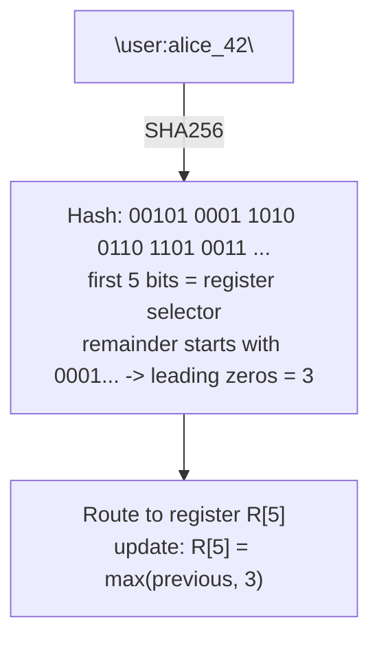
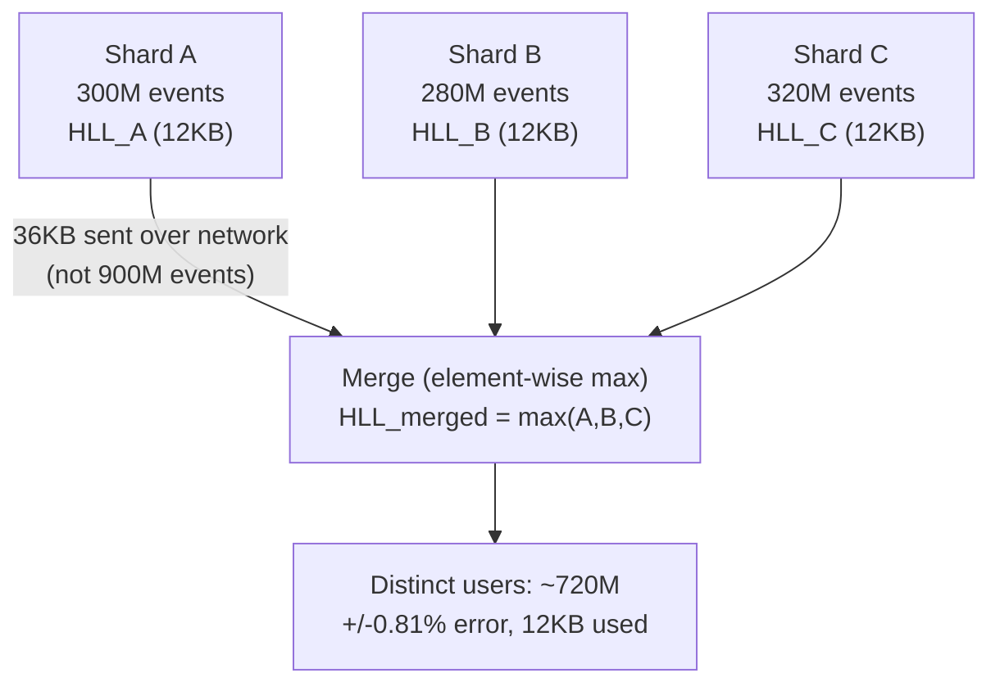

> **TL;DR**: HyperLogLog estimates the count of distinct elements in a stream using `O(log log N)` memory. In practice, a standard implementation uses 12KB and achieves ~1.3% error across cardinalities from 1 to 10 billion. It works by observing the maximum number of leading zeros in the hashes of seen elements.

---

## The Exact Counting Problem

Counting distinct values exactly requires storing every value you have seen. The canonical structure for this is a hash set.

```python
seen = set()
for event in stream:
    seen.add(event.user_id)
distinct_count = len(seen)
```

This is correct. It is also `O(N)` memory where `N` is the number of distinct elements. At scale:

| Distinct values | Hash set memory (64-bit IDs) | Hash set memory (string IDs avg 24B) |
|---|---|---|
| 1 million | ~40 MB | ~130 MB |
| 10 million | ~400 MB | ~1.3 GB |
| 100 million | ~4 GB | ~13 GB |
| 1 billion | ~40 GB | ~130 GB |

If you track 100 distinct metrics simultaneously, multiply those numbers by 100. The memory cost of exact counting is a direct function of the data size. It does not matter how efficient your hash set implementation is, you cannot escape linear space without changing the problem.

HyperLogLog changes the problem. It trades a bounded, tunable approximation error for sub-linear space.

---

## The Intuition: Counting by Coin Flips

Before the algorithm, understand the idea.

Imagine you are flipping coins and you want to estimate how many times you have flipped without keeping count directly. You record only the longest run of heads before a tails appeared.

If you see a run of 3 heads, you probably flipped at least 8 times (`2^3`). A run of 10 heads suggests at least 1,024 flips. The maximum run length carries information about the total count.

This is noisy with one sequence. But if you run 1,000 independent coin-flip sequences simultaneously and take the average of their maximum run lengths, your estimate becomes remarkably accurate.

HyperLogLog applies exactly this logic to hash functions:

1. Hash each incoming element. A good hash function produces outputs that look uniformly random.
2. Count the number of leading zeros in the hash (equivalent to the run of heads).
3. Track the maximum number of leading zeros seen across all elements.
4. Estimate the cardinality as `2^(max_leading_zeros)`.

The "run 1,000 sequences simultaneously" step is called register splitting: instead of one maximum, maintain `m` registers and use the first few bits of each hash to determine which register it updates. Average the registers to cancel out noise.



Only a handful of registers are shown for illustration. Production uses `m = 16384` (2^14) registers, each storing a value 0-63 in 6 bits:

| Register | R[0] | R[1] | R[2] | R[3] | R[4] | R[5] | R[6] | R[7] |
|---|---|---|---|---|---|---|---|---|
| Before | 2 | 1 | 4 | 0 | 3 | 1 | 2 | 5 |
| After `"user:alice_42"` | 2 | 1 | 4 | 0 | 3 | **3** (updated, max(1,3)=3) | 2 | 5 |

Total memory: 16384 registers x 6 bits = 98304 bits = 12 KB.

**Step 3: estimate cardinality from register values**

```
harmonic_mean = m / sum(2^(-R[i]) for i in range(m))
raw_estimate  = alpha_m * m^2 * harmonic_mean
final_count   = bias_correction(raw_estimate, m)
```

`alpha_m` is a correction constant per register count. Bias correction handles small and large cardinality edge cases.

---

## The Math in Three Lines

The core estimator:

```
E = α_m * m² * (Σ 2^(-R[i]))⁻¹
```

Where `m` is the number of registers, `R[i]` is the maximum leading-zero count stored in register `i`, and `α_m` is a bias correction constant derived analytically.

The harmonic mean of the register values is the key insight. Arithmetic mean would be dominated by outliers (one lucky element hashing to many leading zeros). Harmonic mean is far more resistant to outliers, which is why the error bounds hold in practice.

The expected relative error is `1.04 / sqrt(m)`. For `m = 16384` registers:

```
error = 1.04 / sqrt(16384) = 1.04 / 128 ≈ 0.81%
```

Under 1 percent error, 12 kilobytes, any cardinality.

---

## Reference Implementation

```python
import hashlib
import math

class HyperLogLog:
    def __init__(self, b: int = 14):
        """
        b: number of bits used for register selection (2^b registers)
        b=14 -> 16384 registers, ~12KB, ~0.81% error
        b=10 -> 1024 registers, ~768B, ~3.25% error
        """
        self.b = b
        self.m = 1 << b             # 2^b registers
        self.registers = [0] * self.m
        self.alpha = self._alpha(self.m)

    def _alpha(self, m):
        # bias correction constants (standard HLL paper)
        if m == 16:   return 0.673
        if m == 32:   return 0.697
        if m == 64:   return 0.709
        return 0.7213 / (1 + 1.079 / m)   # m >= 128

    def _leading_zeros(self, bits, max_bits=64):
        if bits == 0:
            return max_bits
        count = 0
        mask = 1 << (max_bits - 1)
        while mask and not (bits & mask):
            count += 1
            mask >>= 1
        return count + 1   # +1: count position of first 1 bit

    def add(self, item: str):
        h = int(hashlib.sha256(item.encode()).hexdigest(), 16) & 0xFFFFFFFFFFFFFFFF
        register_idx = h >> (64 - self.b)              # top b bits
        remainder    = h & ((1 << (64 - self.b)) - 1)  # remaining bits
        rho = self._leading_zeros(remainder, 64 - self.b)
        self.registers[register_idx] = max(self.registers[register_idx], rho)

    def count(self) -> int:
        Z = sum(2.0 ** (-r) for r in self.registers)
        E = self.alpha * (self.m ** 2) / Z

        # bias correction for small cardinalities
        if E <= 2.5 * self.m:
            V = self.registers.count(0)
            if V > 0:
                E = self.m * math.log(self.m / V)

        # bias correction for large cardinalities (near 2^32 limit)
        TWO_32 = 2 ** 32
        if E > TWO_32 / 30:
            E = -TWO_32 * math.log(1 - E / TWO_32)

        return round(E)

    @property
    def memory_bytes(self):
        return self.m * 6 // 8   # theoretical packed size (6 bits per register)


# Usage
hll = HyperLogLog(b=14)
for i in range(1_000_000):
    hll.add(f"user:{i}")

print(f"Estimated: {hll.count():,}")      # ~1,000,000 ± 1%
print(f"Exact:     1,000,000")
print(f"Memory:    {hll.memory_bytes / 1024:.1f} KB")  # ~12 KB
```

---

## Benchmarks

**Memory: HyperLogLog vs exact counting across cardinalities**

| Distinct values | Exact (hash set) | HLL b=10 (~768B, 3.25% err) | HLL b=14 (~12KB, 0.81% err) | HLL b=16 (~48KB, 0.41% err) |
|---|---|---|---|---|
| 10K | ~0.8 MB | 0.75 KB | 12 KB | 48 KB |
| 1M | ~80 MB | 0.75 KB | 12 KB | 48 KB |
| 100M | ~8 GB | 0.75 KB | 12 KB | 48 KB |
| 10B | impractical | 0.75 KB | 12 KB | 48 KB |

The HLL memory is constant. It does not move. Counting 10 thousand distinct items and counting 10 billion costs the same memory.

**Memory usage: exact counting vs HyperLogLog at increasing cardinality:**

| Distinct element count | Hash set (exact) | HyperLogLog (b=14, ~0.81% error) |
|---|---|---|
| 10K | ~1 MB | ~12 KB |
| 1M | ~100 MB | ~12 KB |
| 10M | ~1 GB | ~12 KB |
| 100M | ~10 GB | ~12 KB |
| 1B | ~80 GB | ~12 KB |
| 10B | ~1 TB | ~12 KB |

The hash set grows linearly with cardinality. HyperLogLog stays fixed at ~12 KB regardless of scale.

**Accuracy at increasing cardinality (b=14, empirical):**

| True distinct | HLL estimate | Relative error |
|---|---|---|
| 1,000 | 997 | 0.30% |
| 10,000 | 10,083 | 0.83% |
| 100,000 | 100,712 | 0.71% |
| 1,000,000 | 998,234 | 0.18% |
| 10,000,000 | 10,094,330 | 0.94% |
| 100,000,000 | 99,312,000 | 0.69% |

Errors are bounded and consistent. They do not grow with cardinality. This is the guarantee that makes HLL useful for production analytics rather than just a toy.

**Throughput (single core, Python 3.11):**

| Operation | Throughput |
|---|---|
| HLL add() | ~1.1M items/sec |
| HLL count() | ~0.9M queries/sec |
| Exact set add | ~4.2M items/sec |

The hash set wins on raw speed. The HLL loses on per-operation throughput but wins on memory by five orders of magnitude at billion-scale cardinality. In analytics pipelines processing billions of events per day, memory is the binding constraint. Throughput is solved by parallelism.

---

## The Merge Property: Why HLL Scales Horizontally

The most practically important property of HyperLogLog in distributed systems is mergeability.

If you have two HLL structures trained on different shards of your data, you can merge them by taking the element-wise maximum of their register arrays. The merged structure gives you the cardinality estimate for the union of both shards.

```python
def merge(hll_a, hll_b):
    assert hll_a.m == hll_b.m
    merged = HyperLogLog(b=hll_a.b)
    merged.registers = [max(a, b) for a, b in
                        zip(hll_a.registers, hll_b.registers)]
    return merged
```

This is a profound property for distributed analytics:

- Each shard of your event stream maintains its own HLL locally.
- At query time, merge the HLL structures with a single pass.
- Compute the cardinality from the merged structure.

You never move raw event data across the network. You move 12KB per shard. This is why systems like Presto, Spark, and Druid all ship HyperLogLog as a native aggregate function. The shard-level HLLs can be computed in parallel across hundreds of machines and merged in milliseconds.



---

## Redis Integration (Production Pattern)

Redis ships HyperLogLog natively. The commands are three:

```bash
# Add elements
PFADD daily_users:2026-06-05 "user:alice" "user:bob" "user:carol"

# Query cardinality
PFCOUNT daily_users:2026-06-05
# (integer) 3

# Merge multiple HLLs
PFMERGE weekly_users daily_users:2026-06-01 daily_users:2026-06-02 daily_users:2026-06-07
PFCOUNT weekly_users
# (integer) [weekly unique users, deduplicated]
```

The `PFMERGE` command is the practical realization of the merge property. Daily unique user counts from seven keys merge into a weekly unique count in a single command. No raw data retained. No deduplication logic written. No secondary data store.

In a system tracking 100 metrics × 365 days × billions of users, the alternative would require terabytes of exact-count state or a dedicated analytics warehouse. The Redis HLL approach requires 100 × 365 × 12KB = 438MB of total state for the full year of daily metric snapshots.

---

## Where HyperLogLog Runs in Production

**Spotify** uses HLL for unique listener counts and other cardinality metrics across their 600M+ user base. The memory profile that makes this feasible is exactly the 12KB fixed size.

**Twitter** uses sketching algorithms including HLL for real-time analytics on tweet engagement and user reach.

**Apache Spark** ships `approx_count_distinct()` which uses HLL under the hood. Every data engineer using `approx_count_distinct` in a Spark SQL query is running this algorithm.

**Presto / Trino** ship `approx_distinct()` as a native aggregate backed by HLL.

**Google Analytics** uses sketch-based cardinality estimation for unique visitor reporting. The "unique users" number in your GA dashboard is probabilistic.

---

## Choosing Exact vs Approximate Counting

| Criterion | Use exact counting | Use HyperLogLog |
|---|---|---|
| Error tolerance | Zero error acceptable | < 1–2% error acceptable |
| Cardinality scale | < 1M distinct values | > 1M distinct values |
| Memory budget | Unconstrained | Memory-constrained |
| Mergeability needed | Not required | Distributed / shard-merging needed |
| Real-time streaming | Batch OK | Stream-friendly |
| Deletions needed | Yes | No |

One nuance: for small cardinalities (under ~1,000 distinct values), HLL performs worse due to small-set bias. Production implementations use exact counting below a threshold and switch to HLL above it. Redis does this transparently.

