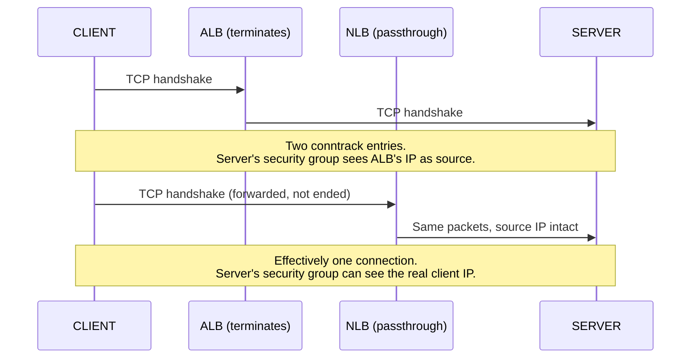
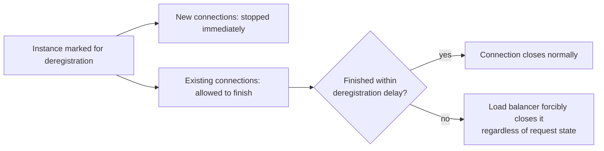

Part 1 was the security group. Part 2 went one layer deeper, into iptables, nftables, and conntrack, and found that a correctly configured security group means nothing if the OS underneath it is doing something the review never saw. Same shape both times: review one boundary, assume the system is reviewed, miss the boundary sitting right next to it.

This part goes to the boundary most setups actually run traffic through before it ever reaches either of the first two. Most production instances aren't reachable directly from the internet at all. A load balancer sits in front, and everything Part 1 and Part 2 described, the security group's connection tracking, the kernel's conntrack table, all of it operates on a connection that the load balancer created, not the one the client opened.

That distinction sounds pedantic until you've spent an afternoon chasing intermittent drops that only happen under load, only affect some percentage of requests, and vanish the moment you SSH in to look. This is usually where that afternoon goes wrong.

## Termination vs. Passthrough

A load balancer can do one of two fundamentally different things with an incoming connection, and which one it does changes everything downstream.

**Termination** means the load balancer ends the client's TCP connection at itself and opens an entirely separate TCP connection to your instance. Two independent connections, two independent handshakes, two independent conntrack entries, stitched together by the load balancer relaying data between them. An Application Load Balancer always does this. It operates at layer 7, has to parse HTTP to make routing decisions, and cannot do that without fully terminating the connection first.

**Passthrough** means the load balancer forwards the original packets largely intact, without ending the client's connection. A Network Load Balancer, operating at layer 4, defaults to this mode for instance targets and same-VPC IP targets. The client's TCP handshake effectively completes with your instance, not with the load balancer.



This is the fact everything else in this post follows from. With an ALB, the connection your security group and your conntrack table are tracking is between the load balancer and your instance. The client's actual connection ended one hop earlier, at a piece of infrastructure you don't operate and can't inspect with `conntrack -L`.

## Source IP Preservation Is a Decision, Not a Default

Once you accept that termination happens, the next question is where the client's real IP address goes, and the answer depends entirely on which load balancer and which configuration you're running.

**ALB (always terminates, HTTP/HTTPS):** the client's IP survives only because the ALB writes it into an `X-Forwarded-For` header on the new HTTP request it sends to your instance. If your application reads `req.socket.remoteAddress` instead of that header, every request will appear to originate from the ALB's own address, and every IP-based rate limit, every geo-block, every audit log you write will be wrong in the same direction. This is a code-level decision, not an infrastructure one, and it's routinely missed because the request still \"works\" with the wrong IP in it. Nothing errors. It just lies.

**NLB with instance targets (layer 4, default passthrough):** the original source IP reaches your instance's network interface unchanged, because the NLB isn't terminating the TCP connection at all for this target type. Your security group can filter on the real client IP directly.

**NLB with IP targets, or cross-VPC/cross-account routing:** passthrough is no longer guaranteed. AWS exposes an explicit **client IP preservation** attribute on the target group for exactly this case, and it defaults differently depending on target type. If it's off, the NLB performs source NAT, rewriting the source to its own address, and you're back to needing the PROXY protocol or an equivalent header to recover the real client IP.

**PROXY protocol** is the layer-4 equivalent of `X-Forwarded-For`. Instead of a header (which requires HTTP), the load balancer prepends a small block of text containing the original source IP and port to the raw TCP stream before your application's normal data starts. Your application or your local reverse proxy has to know to read and strip this block before parsing anything else, or it will try to parse the PROXY protocol line as if it were the first line of your actual protocol and fail in a way that looks like random corruption.

```
# What a v1 PROXY protocol line looks like on the wire,
# before your application's actual payload begins
PROXY TCP4 203.0.113.42 10.0.1.15 51234 443\r\n
```

The rule of thumb that actually holds across all of this: **never assume source IP preservation. Check the specific target group attribute, the specific load balancer type, and the specific header or protocol your application is configured to trust.** Getting this wrong doesn't produce an error. It produces a system that works and lies to you about who it's talking to, which is a worse failure mode than a system that breaks.

## Why This Breaks the Security Group Assumption from Part 1

Part 1 covered the SG-references-SG pattern as the correct way to scope access: instead of allowing a CIDR, allow anything wearing a specific security group. A load balancer is exactly where that pattern becomes mandatory rather than a nice-to-have.

Once an ALB terminates the client connection, the connection reaching your instance's security group has a source of the load balancer's own elastic network interfaces, not the client. A security group rule written as "allow port 443 from `203.0.113.42/32`" to lock a backend down to a specific known client IP simply stops matching anything, because that IP never touches the backend's ENI again. The rule needs to move one hop earlier, onto the load balancer's own security group, and the backend's security group needs to instead allow traffic from the load balancer's security group by reference, exactly the pattern from Part 1's Terraform example.

```hcl
resource "aws_security_group" "alb" {
  name = "alb-prod"
  ingress {
    description = "Public HTTPS, filtering happens here now"
    from_port   = 443
    to_port     = 443
    protocol    = "tcp"
    cidr_blocks = ["0.0.0.0/0"]
  }
}

resource "aws_security_group" "api" {
  name = "api-prod"
  ingress {
    description     = "Only from the ALB, never from a raw client IP again"
    from_port       = 3000
    to_port         = 3000
    protocol        = "tcp"
    security_groups = [aws_security_group.alb.id]
  }
}
```

This is a small change on paper and an easy one to miss during a migration, because the old CIDR-based rule on the backend often gets left in place "just in case" instead of removed, which quietly reopens the exact exposure the ALB was supposed to narrow.

## Health Checks Are Not Real Traffic, and They're Not Trying to Be

A load balancer's health check hits your instance on a schedule, on a specific path, expecting a specific status code, and closes the connection immediately after. None of this resembles the traffic your capacity planning or your conntrack tuning from Part 2 was built around.

A few concrete differences that catch teams in production:

**Health checks skip most of your request path.** A typical health check endpoint returns a 200 with no database call, no session lookup, no external API dependency. It proves the process is alive and the port is open. It does not prove the database connection pool isn't exhausted, or that the dependency your actual endpoints call is reachable. An instance can pass every health check while every real request behind it fails.

**Health checks don't reuse connections the way real clients do.** Each check is typically its own short-lived connection, opened, used once, closed. If your conntrack table or your application's connection pool assumptions were tuned around a small number of long-lived client connections (the picture Part 2 described with keep-alive and `ESTABLISHED` state), a fleet of health checkers opening and closing thousands of short connections a minute is a different traffic shape entirely, and it's the shape most likely to expose a conntrack table sized for the wrong workload.

**A failed health check removes an instance from rotation, not from existence.** The instance keeps running, keeps holding whatever connections were already in flight, and keeps doing whatever made it fail the check in the first place, silently, outside the load balancer's view, until someone goes looking at the instance directly instead of at the load balancer's target health dashboard.

## Connection Draining: Where the Previous Two Posts' Assumptions Meet a Deadline

AWS calls this **deregistration delay** on target groups (the older, still commonly used term is connection draining). When an instance is being removed from a target group, whether from a deploy, a scale-in event, or a manual health check failure, the load balancer stops sending it new connections immediately but keeps existing, in-flight connections alive for a configured window before forcibly closing them.



This is precisely where the conntrack timeout discussion from Part 2 and this layer intersect. If your deregistration delay is shorter than a real request can legitimately take, in-flight requests get cut mid-response during every deploy, and the failure looks exactly like the "randomly dropped after sitting idle" symptom from Part 2, except the trigger here is a deployment event instead of an idle timeout. If it's set far longer than any real request takes, scale-in events and deploys take proportionally longer to complete, because the load balancer is waiting out a timer for connections that finished ages ago just to be safe.

The number that actually matters here is your own p99 request duration under real load, not a round number picked because it sounded reasonable. A deregistration delay of 30 seconds on a service where the slowest 1% of requests legitimately take 45 seconds guarantees you clip requests on every single deploy, and nothing in the load balancer's own metrics will tell you that's what happened. It just shows up as a small, mysterious error rate bump exactly at deploy time, forever, until someone checks the actual request duration distribution against the actual delay setting.

## The Case That Keeps Repeating

A team runs a service behind an ALB. Users intermittently report failed requests, maybe two or three percent of traffic, no clear pattern by time of day or endpoint. The on-call engineer checks the security group (fine, matches Part 1's pattern exactly), checks iptables and conntrack on the instance (fine, matches Part 2), and finds nothing. The instance-level logs show the requests that failed simply never arrived.

The actual cause, reliably, in one of a small number of shapes: the deregistration delay is shorter than the slowest real requests, and the drops cluster around deploys nobody thought to correlate against the error timestamps. Or, the health check path is lightweight enough to stay green while a downstream dependency the health check never touches is intermittently failing, so the load balancer keeps routing full traffic to an instance that's failing a fraction of its real requests. Or, source IP preservation was assumed and never verified, so every rate limit and every fraud check keyed on client IP has been silently keying on the load balancer's address instead, either blocking legitimate users who share that apparent source or, more dangerously, failing to block anyone at all.

None of these three show up in a security group review. None of them show up in an `iptables -S` audit. They live specifically in the load balancer's own configuration, which is exactly the layer this series keeps finding: reviewed thoroughly by whoever set it up initially, revisited by almost nobody afterward, because it works until a specific condition (a slow request, a flaky dependency, a client-IP-dependent feature shipped six months later) exposes the gap.

## Auditing This Layer

The commands differ from Part 1 and Part 2 because this layer lives in the load balancer's control plane, not the instance's kernel, but the discipline is the same: read the actual configuration instead of trusting what you remember setting.

```bash
# Target group health check configuration: path, interval, thresholds
aws elbv2 describe-target-groups \
  --query 'TargetGroups[*].{Name:TargetGroupName,HealthPath:HealthCheckPath,Interval:HealthCheckIntervalSeconds,Timeout:HealthCheckTimeoutSeconds}' \
  --output table

# Deregistration delay and client IP preservation, both live in target group attributes
aws elbv2 describe-target-group-attributes --target-group-arn <arn> \
  --query 'Attributes[?Key==`deregistration_delay.timeout_seconds` || Key==`target_group_ip_address_type` || Key==`preserve_client_ip.enabled`]'

# Current target health, separate from whether the instance is actually fine
aws elbv2 describe-target-health --target-group-arn <arn> \
  --query 'TargetHealthDescriptions[*].{Target:Target.Id,State:TargetHealth.State,Reason:TargetHealth.Reason}'

# From the instance itself: is the incoming source actually the client, or the load balancer?
sudo tcpdump -i eth0 -n 'tcp port 443' -c 5
```

That last command is the one worth running before assuming anything. If the source addresses in that capture belong to the load balancer's own subnet rather than a spread of real client IPs, source IP preservation isn't happening at the network layer, and any code relying on the raw connection source instead of a forwarded header or PROXY protocol line is working against fiction.

## Where the Ownership Gap Actually Sits

Three posts in, the pattern isn't really about security groups, or iptables, or load balancers individually. It's that each layer is fully legible on its own, has its own dashboard, its own review checklist, its own person who configured it competently at the time, and none of those checklists include the boundary where it hands off to the next layer. The security group review doesn't ask what the OS does with allowed traffic. The OS-level audit doesn't ask what a load balancer changed about the connection before it arrived. The load balancer's own console shows target health and lets you feel done, without ever asking whether the health check is even checking the part that breaks.

The fix isn't a fourth tool. It's treating the boundary itself, not the layer, as the thing that needs an owner. Every handoff point in this series so far, security group to OS firewall, OS firewall to load balancer, is a place where a completely correct configuration on both sides can still produce a gap that belongs to neither.
