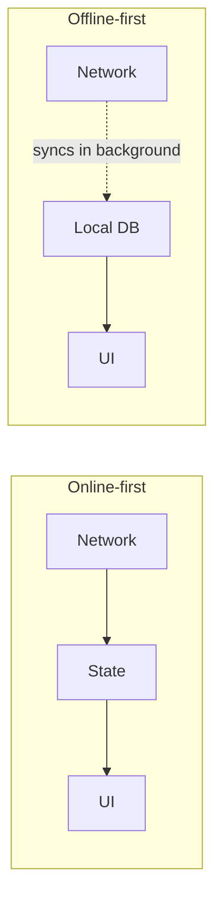
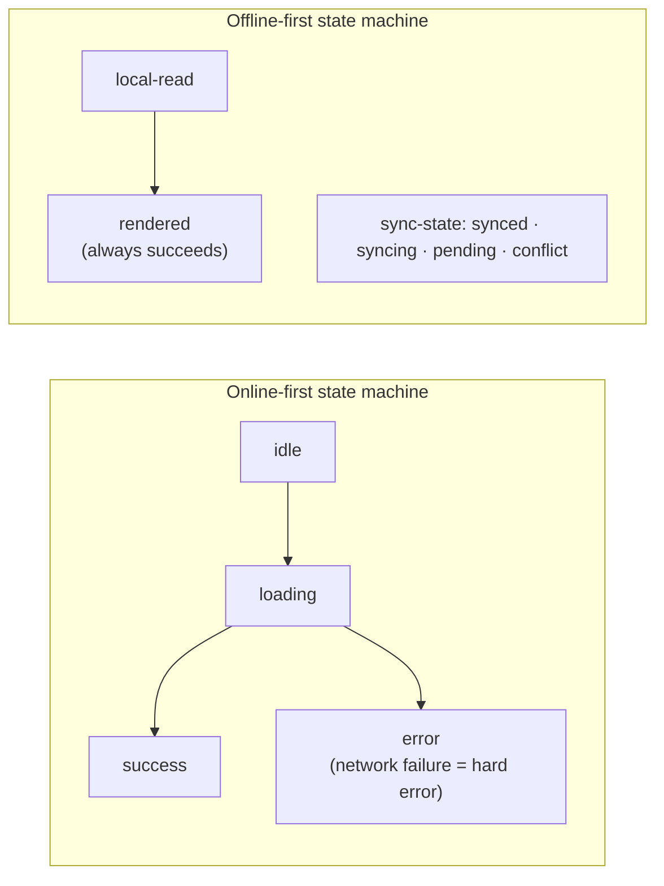

"We'll add offline support before launch" is the engineering equivalent of "we'll add tests after it's working." It reveals a misunderstanding of what offline-first actually is.

Offline support is not a feature. It's an architectural commitment that determines how you store data, how you handle conflicts, how you design your sync layer, and how you structure your UI state. It touches every layer of the application. Adding it after the fact means rebuilding the application.

## What "Online-First" Architecture Looks Like

I've seen this pattern many times — and I inherited it on OurStoryz:

```typescript
// Online-first data fetching — the default pattern
async function getEventGuests(eventId: string): Promise<Guest[]> {
  // Network is the source of truth. No network = no data.
  const response = await fetch(`/api/events/${eventId}/guests`);
  if (!response.ok) throw new Error("Failed to load guests"); // ← offline = hard failure
  return response.json();
}

// Online-first UI state
function GuestList({ eventId }: { eventId: string }) {
  const [guests, setGuests] = useState<Guest[]>([]);
  const [loading, setLoading] = useState(false);
  const [error, setError] = useState<string | null>(null);

  useEffect(() => {
    setLoading(true);
    getEventGuests(eventId)
      .then(setGuests)
      .catch(e => setError(e.message)) // ← offline shows error state
      .finally(() => setLoading(false));
  }, [eventId]);

  if (loading) return <Spinner />;
  if (error)   return <ErrorMessage message={error} />; // ← user sees this offline
  return <GuestListView guests={guests} />;
}
```

This architecture is reasonable when connectivity is guaranteed. In an event venue with 300 people on the same Wi-Fi, it fails constantly.

## What Offline-First Architecture Looks Like

When we accepted that offline-first was the actual requirement, the entire design changed:

```typescript
// Offline-first: local DB is source of truth, server is sync target
async function getEventGuests(eventId: string): Promise<Guest[]> {
  // ALWAYS read from local. Fast. No network required.
  const localGuests = await realmDb.objects<Guest>("Guest")
    .filtered("eventId == $0", eventId);

  // Trigger background sync — but don't block the read
  syncService.requestSync(eventId).catch(console.warn);

  return Array.from(localGuests);
}

// Offline-first UI state: loading is always near-instant (local read)
function GuestList({ eventId }: { eventId: string }) {
  const [guests, setGuests] = useState<Guest[]>([]);
  const [syncState, setSyncState] = useState<"synced" | "pending" | "offline">("pending");

  useEffect(() => {
    getEventGuests(eventId).then(setGuests); // fast, synchronous-ish

    // Subscribe to sync state changes
    const unsub = syncService.onStateChange(setSyncState);
    return unsub;
  }, [eventId]);

  // No error state for "offline" — that's a normal operating condition
  // UI shows sync indicator, not an error message
  return (
    <>
      <SyncIndicator state={syncState} />
      <GuestListView guests={guests} />
    </>
  );
}
```

The guest list always renders. The sync indicator tells the user their connectivity status. Offline is a first-class state, not an error.

## The Four Architectural Changes Offline-First Requires

### 1. Data Layer: Local First



The local database (Realm, WatermelonDB, SQLite) is the primary source of truth. The server is a sync target, not the source of truth.

### 2. Conflict Resolution Policy

When two devices modify the same record while disconnected and both sync — who wins? You need a policy before you write sync code:

- **Last-write-wins (LWW)**: simplest, loses concurrent updates
- **Server-authoritative**: server always wins, predictable, limits offline functionality
- **CRDT (Conflict-free Replicated Data Types)**: complex to implement, no conflicts by construction
- **Merge functions**: domain-specific logic (e.g., quantities add, statuses use defined precedence)

For OurStoryz, we used server-authoritative for core guest status (checked-in/not) and LWW for profile edits. The choice was based on which conflicts are recoverable vs. destructive.

### 3. UI State: New Mental Model

Loading states stop making sense when reads are always local and instant. The state machine changes:



Error states shift from "network failed" to "sync conflict detected" — a much rarer and more actionable condition.

### 4. Transport Layer: Queues, Not Requests

Mutations stop being immediate HTTP requests and become queued operations:

```typescript
interface QueuedMutation {
  id: string;
  type: "CHECK_IN" | "UPDATE_PROFILE" | "MARK_VIP";
  payload: unknown;
  queuedAt: number;
  attempts: number;
}

async function checkInGuest(guestId: string): Promise<void> {
  // Apply optimistically to local DB immediately
  await realmDb.write(() => {
    const guest = realmDb.objectForPrimaryKey("Guest", guestId);
    if (guest) guest.checkedIn = true;
  });

  // Queue for sync — will retry until acknowledged
  await mutationQueue.enqueue({
    type: "CHECK_IN",
    payload: { guestId, timestamp: Date.now() },
  });
}
```

The UI updates instantly. The server eventually gets the mutation. If the device goes offline for 30 minutes, it catches up when connectivity returns.

## The Refactor Cost Is Not Worth It

If you're building a mobile app for any environment where connectivity is uncertain — field work, events, industrial settings, travel — don't add offline support. Start offline-first.

The delta between an online-first and offline-first architecture is not additive. You're not adding a sync layer. You're inverting the data flow, redesigning the state model, and rebuilding the mutation layer. That's 70% of a new app.

The conversation you need to have with your product team before writing a line of code: "Is reliable offline use a requirement?" If yes, that conversation changes the architecture, the timeline, and the tech choices. Have it first.


---

> If you are at the "we need offline support" conversation right now — before the architecture is locked — that is the right time to bring me in. Retrofitting costs more than doing it right the first time. [Get in touch](/contact).